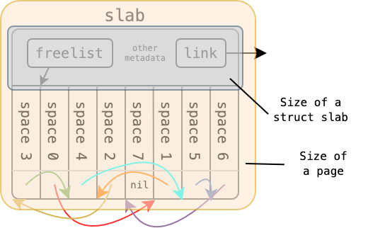
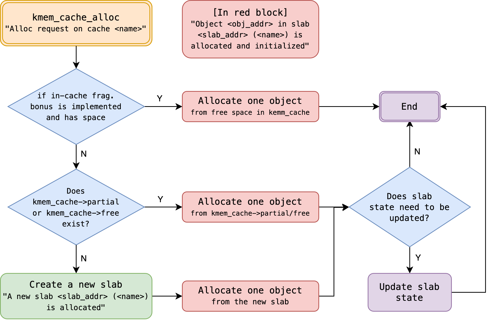
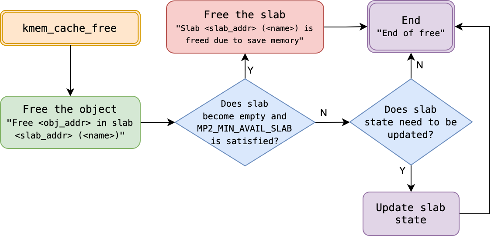

# MP2 Memory management: Kernel Memory Allocation (slab)

## 基本資訊

* 滿分: 125% (基本部分: 100%, 加分部分 25%)
* 釋出日期: 2025/03/18
* 截止日期: 2025/04/03 23:59:59
* 遲交期限: 2025/04/08 23:59:59
* 助教信箱: ntuos@googlegroups.com
* TA hours: Wed. 13-14 p.m., Fri. 11 a.m. -12 p.m., at CSIE B04

[TOC]


## 概述

在 MP2 作業中，我們將探討 **核心小型物件的記憶體配置與釋放機制**，並請學生在 `xv6` 作業系統上 **設計並實作 slab 配置器**。

本次作業的重點包括：
- **slab 配置器的資料結構設計**
- **小型物件配置的時間與空間效率優化**
- **與 slab 相關的多種優化技術**

透過本作業，學生將能夠體驗 **系統記憶體管理的設計與實作過程**，並學習如何提升核心記憶體配置的效率。

## 環境設定與準備

請確認以下步驟，以確保開發環境設置完成：

1. 確保已安裝 [Git](https://git-scm.com/)
2. 確保擁有 [GitHub 帳號](https://github.com/)，若無，請先註冊
3. 透過以下 MP2 專屬 GitHub Classroom 連結，點擊 **Accept this assignment**，系統將為同學建立專屬的作業 Repository `mp2-<USERNAME>`。由於本課程學生人數較多，故分成兩個 classroom，推薦使用第一個連結加入，請同學不要重複加入。
   1. [連結一 (推薦)](https://classroom.github.com/a/8RRWnxeC)
   2. [連結二](https://classroom.github.com/a/99lR2XaX)
4. 存取同學的 MP2 Repository `https://github.com/ntuos2025/mp2-<USERNAME>`
5. 在本地端複製 Repository：
    ```bash
    git clone https://github.com/ntuos2025/mp2-<USERNAME>
    ```
6. 在 Repository 內的 `student_id.txt` 檔案中填入同學的學號，例如：
    ```log
    b12345678
    ```
7. 運行 `mp2.sh` MP2 腳本工具：
    ```bash
    ./mp2.sh setup # 進行基本設定
    ```
    其他使用方式可以使用 `./mp2.sh` 查看。
8. [運行功能測試](#mp2sh-腳本使用說明) (public tests)：
    ```bash
    ./mp2.sh test [case]  # See the appendix for more information
    ```
    由於模板的程式碼還沒實現 system call，預設編譯將不會通過。

# 評分標準與繳交方式

## 評分標準

本作業總分 **125%**，其中包含 **基本要求與加分項目**。建議學生 **先完成基本實作，再挑戰額外的加分項目**。

### 基本要求

- [slab 設計](#struct-slab-設計) (5%)
- 功能測試 (Public Tests) (75%)
  - 包含 25 筆測資，每筆 3%
- 隱藏測試 (Private Tests) (20%)
  - 包含 4 筆測資，每筆 5%

### 加分項目

加分項目與基本要求不衝突，且加分項目不互相影響，可以選擇實現多個項目。

- [`struct slab` 記憶體優化](#struct-slab-設計) (+5%)
- [`kmem_cache` 內部碎裂優化](#kmem_cache-的內部碎裂問題-加分項目) (+10%)
- [以 `kernel/list.h` 管理 slab](#struct-slab-設計) (+10%)

## 提交與評分方式

所有程式碼將透過 git 繳交至 **GitHub Classroom**，請確保同學的最終提交符合規範。

本次作業引入全自動化提交與評分流程。學生只需將程式碼推送至 GitHub，系統將自動執行評分並提交結果。

評分包含以下四項測試，學生可前往個人 MP2 儲存庫（Repository）中的 GitHub Actions 查看執行結果：

- **slab 結構測試** (5% + 5% 加分)
- **功能測試** (75%)
  - 若功能測試得分超過 66 分，將進一步執行以下兩項加分測試；否則將直接跳過加分項目計分：
    - **List API 測試** (+10%)
    - **In-Cache 測試** (+10%)
  - 注意：此邏輯與 `./mp2.sh test all` 的執行方式有所不同。後者旨在方便學生無論得分高低，均可一次性測試所有測試案例。
- **隱藏測試** (20%)

在截止日期前，學生可重複提交程式碼。作業將於 3/31 00:00:00 通過預設的 GitHub Actions 進行一次自動評分，該流程將檢查提交歷史與測試結果，並可以在 GitHub Actions 介面瀏覽結果。請注意當 Github Action 完成並顯示綠色圓點後，不代表得到滿分，欲知分數請至 Github Action 內查看。

最終評分將於截止日期後一週（2025/04/10 00:00:00）自動進行並上傳成績。截止日期 (2025/04/03) 後仍可提交，但將依遲交天數扣分，每遲交一天扣減 20%，至第五天 (2024/04/08) 得分降為 0%。學生可於 2025/04/10 後至 GitHub Actions 查看最終評分結果。

請學生[務必嚴格遵守檔案修改規範](#檔案修改規則)。為避免提交時意外修改受限檔案，建議執行 `./mp2.sh setup`，該命令將啟用 Git Hook 保護受限檔案。截止日期後，助教將審查是否存有違規修改受限檔案的情形。若發現違規，視為作弊，該次作業將評為 0 分。此外，若學生試圖利用安全性漏洞影響自身或他人成績，一經查證，將認定為作弊，該次作業評為 0 分。

# 問題背景：核心記憶體管理的挑戰

想像今天 kernel 要配置 100 個大小為 `40B` 個系統物件，比如 xv6 中的 `struct file`。若每個物件都要以一個頁面儲存，不僅需要配置頁面時的開銷，還會遇到非常嚴重的內部碎裂問題，特別是面對小型系統物件的配置。

若能利用這些系統物件大小相同的特性，核心預先配置一個乃至數個連續的頁面，並將其內部空間以 `40B` 為單位進行切割，便能盡可能地利用整個頁面的空間，減少內部碎裂，由於可能短時間內對相同頁面重複存取，且大多數的配置可以重複利用舊的頁面而非配置新頁面，也能加速配置所需的時間。

> 
> 回顧課程投影片。

slab 便是這樣一個系統，源自 SunOS 原始碼，為過去 Linux kernel 實現小型系統物件記憶體配置的機制。本作業將引導學生 **設計並實作一個新的 slab 記憶體配置系統**，以提升 xv6 中小型物件 `struct file` 的記憶體管理效能。

題外話，MP2 的助教們所屬的實驗室簡稱為 NEWSLAB，可以斷句為 NewSlab，這便是我們 MP2 的目標！嗯...希望不要太冷。

# slab 配置器的初步設計與 API

## slab 配置器的初步設計

在 slab 配置器的設計中，我們的目標是：

1. 為具有相同大小的核心物件配置頁面。
2. 將頁面切分為固定大小的物件，以提高記憶體使用效率。

為簡化設計，**假設核心一次僅能配置單一頁面**，而無法一次配置多個連續頁面。基於此假設，我們定義 `struct slab`，其大小等同於單個頁面，並包含物件的類別名稱 `name`、每個物件的大小 `object_size`，以及管理可用物件的 `freelist`。

```c
struct slab {
    char name[MP2_CACHE_MAX_NAME];
    uint object_size;
    void **freelist;
    ...
};
```

在 C 語言中，`void *` 表示指向任意類型的指標，然而由於其型別不確定，無法直接取值，因此需要將其轉型為特定類型的指標才能進行操作。`(void *) *freelist` 代表一個 `void *` 陣列，或是一個指向 `void *` 的指標。關於 `freelist` 的詳細結構，將在[後續章節](#freelist-的資料結構)進一步說明。

由於對於相同類型的系統物件而言，`name` 和 `object_size` 皆為相同屬性，因此可在 `struct slab` 之上設計一個額外的結構體 `struct kmem_cache`，用來統一管理相同類型物件的共用資訊，藉此減少 `struct slab` 的記憶體開銷。

```c
struct slab {
    void **freelist;
    ... // 其他成員可依需求擴充
};

struct kmem_cache {
    char name[MP2_CACHE_MAX_NAME];
    uint object_size;
    struct slab *slab; // 記錄當前使用的 slab
    ... // 其他成員可依需求擴充
};
```

我們期望這些結構體能夠提供以下四項核心功能：

```c
// 初始化一個 slab 配置器，管理名稱為 name、大小為 object_size 的系統物件
struct kmem_cache *kmem_cache_create(char *name, uint object_size);

// 配置一個系統物件並回傳
void *kmem_cache_alloc(struct kmem_cache *cache);

// 釋放一個先前配置的系統物件 obj
void kmem_cache_free(struct kmem_cache *cache, void *obj);

// 銷毀 kmem_cache（不列入評分範圍）
void kmem_cache_destroy(struct kmem_cache *cache);
```

使用這些 API，其他核心開發者可透過以下方式進行記憶體管理：

```c
// 初始化 struct file 的 slab 配置器
struct kmem_cache *file_cache = kmem_cache_create("file", sizeof(struct file));

// 配置一個 struct file 物件
struct file *file_allocated = (struct file *) kmem_cache_alloc(file_cache);

// 釋放一個 struct file 物件
kmem_cache_free(file_cache, file2release);

// 當不再需要 file_cache 時，將其銷毀
kmem_cache_destroy(file_cache);
```

這是 MP2 作業中 slab 配置器的介面設計，也是本次實作的核心目標。在接下來的章節中，我們將深入探討其具體實作細節。

## API 介面

本次作業應提供以下 slab API，以供 `xv6` 核心使用：

### 1. `kmem_cache_create`

```c
struct kmem_cache *kmem_cache_create(const char *name, size_t object_size);
```
- **功能**: 初始化一個 `kmem_cache`，用於管理特定大小的物件。
- **參數**:
  - `name`：快取名稱 (供除錯與管理使用)。
  - `object_size`：物件大小 (單一物件的記憶體需求)。
- **回傳值**: 指向新建立的 `kmem_cache` 的指標。

### 2. `kmem_cache_alloc`

```c
void *kmem_cache_alloc(struct kmem_cache *cache);
```
- **功能**: 從 `kmem_cache` 取得可用物件。
- **參數**:
  - `cache`：指向 `kmem_cache` 結構的指標。
- **回傳值**: 成功時回傳指向已配置物件的指標，失敗時回傳 `NULL`。

### 3. `kmem_cache_free`

```c
void kmem_cache_free(struct kmem_cache *cache, void *obj);
```
- **功能**: 將物件歸還至 `kmem_cache`，使其可供後續配置。
- **參數**:
  - `cache`：指向 `kmem_cache` 結構的指標。
  - `obj`：指向待釋放物件的指標。

# slab 配置器的實作的考量點

## `freelist` 資料結構

在閱讀前述內容後，同學或許已經迫不及待地想在 `xv6` 中實作 slab 記憶體配置機制。然而，在實作過程中，**如何設計 `freelist` 資料結構** 將是一個關鍵挑戰。

首先，`freelist` 本質上是一塊連續的記憶體區域，亦即 **一個陣列**。對於任何陣列來說，獲取可用元素或釋放元素的時間複雜度通常為 $O(n)$，其中 $n$ 為 `freelist` 中可放置的的最大總物件數。然而，在追求高效能的核心，比如 Linux kernel 中，如此高的複雜度顯然不可接受。因此，我們需要採用 **更適合的資料結構** 來優化配置與釋放的時間。

## 鏈結串列的應用

學習過資料結構的讀者應該熟悉，**鏈結串列** 允許在 $O(1)$ 的時間內進行元素的移除和插入，可以分別用來實作物件的配置與釋放，這正是 `freelist` 的命名由來。我們可以將 `freelist` 視為一個尚未配置物件的鏈結串列，並透過以下方式進行操作：

- **配置物件**：從 `freelist` 取出第一個可用物件，並更新 `freelist` 指標。
- **釋放物件**：將釋放的物件插入 `freelist`。

如此一來，**物件配置與釋放的時間複雜度均為 $O(1)$**，大幅提升效能。

## 如何為連續記憶體建立鏈結串列？

一種直觀的做法是 **額外建立一個鏈結串列來記錄陣列中的可用記憶體地址**。假設原本的物件陣列為 `objects`，而 `freelist` 用於存放可用物件的地址，結構如下：

```c
struct slab {
    void **objects;
    void **freelist; // 鏈結串列，初始時記錄所有可用物件的地址
};
```

然而，這種設計存在兩個問題：

1. 需要額外的記憶體來存放 `freelist` 的鏈結節點。
2. `freelist` 本身的記憶體配置與管理問題依然尚未解決。

對這類問題，Linux 核心開發者常利用 C 語言 **一塊記憶體各自表述** 的技巧，直接將尚未配置的記憶體用於存儲鏈結串列的指標，最大限度地利用已經配置的記憶體。具體而言，**每個未使用的物件可以直接存放指向下一個可用物件的指標**，從而形成鏈結串列。概念上與前述設計相同，但能一次解決前述設計所遇到的問題。

假設系統物件的大小皆 **不小於一個指標的大小**，則我們可以安全地將 **尚未被配置的物件視為鏈結串列節點**。以下是 `freelist` 的運作示例：

```c
struct slab {
    void **freelist;
    ...
};

struct slab *s = ...;
// 取得第一個可用物件
void *free_obj = s->freelist;
// `free_obj` 的第一個指標大小的空間存放的是下一個可用物件的地址
void *next_free_obj = *(void **)free_obj;
// 重新解釋記憶體為具體的系統物件 (例如 struct file)
struct file *f = (struct file *) free_obj;
struct file *f_next = (struct file *) next_free_obj;
```

太多 `void *` 看起來很眼花撩亂嗎？xv6 中 [`kernel/kalloc.c`](../kernel/kalloc.c) 提供一個可讀性高的實作方式。

```c
// in kamlloc.c
// struct run 是將一塊記憶體解釋為一個有 next 成員的結構體
struct run {
    struct run *next;
};

struct {
    struct spinlock lock;
    struct run *freelist;
} kmem;
```

如此一來前面的用例可以等價的改寫為

```c
struct slab {
    struct run *freelist;
    ...
};

struct slab *s = ...;
// 取得第一個可用物件的指標
struct run *r = s->freelist;
// 由於第一個可用物件中 `next` 成員藏有下一個可用物件的地址
struct run *r_next = r->next;
// 重新解釋記憶體為特定的系統物件 (比如 struct file)
struct file *f = (struct file *) r;
struct file *f_after_f = (struct file *) r_next;
```

同學們也可以在一個核心物件的空間內放兩個指標，實現雙向鏈結串列。請根據 [slab 配置器的實作要求](#實作要求)，為 freelist 設計合適資料結構。

## `freelist` 的元素數量

考慮一個 slab 佔用一個頁面，`freelist` 中應該有

$$
\dfrac{\rm{Page\ size - Metadata\ size\ in\ a\ slab}}{\rm{Size\ of\ each\ object}}
$$

個元素。

## `kmem_cache` 資料結構

`kmem_cache` 是 slab 配置器中負責管理同類型物件記憶體配置的核心結構，其雛形如下：

```c
struct slab {
    <ptr> freelist;
    ... // 其他欄位可依需求擴充
};

struct kmem_cache {
    char name[MP2_CACHE_MAX_NAME];
    uint object_size;

    struct slab *slab; // 指向當前使用的 struct slab

    ... // 其他欄位可依需求擴充
};
```

在系統設計中，需注意以下幾點：

- `struct kmem_cache` (以及 `struct slab`) 的大小為一個頁面，為固定值，無法動態調整。
- 為了提高記憶體配置效率，`struct kmem_cache` 應指向尚有可用空間的 slab 清單，常見 slab 清單分類如下：
  - **已滿 (`full`)**：所有物件皆已配置。
  - **部分使用 (`partial`)**：仍有可用物件。
  - **空閒 (`free`)**：尚未使用的 slab。
- **當所有現有 slab 皆已滿時，應配置新的頁面以產生額外的 slab**。因此，儘管每個 `kmem_cache` 僅對應單一物件類型，其所管理的 slab 數量可能會隨記憶體需求動態變化。

由於 `kmem_cache` 可能需動態管理大量 slab，因此將 `kmem_cache::slab` 設計為陣列並不實際，改採 **鏈結串列** 會更符合需求。此設計可改進為：

```c
struct slab {
    <ptr> freelist;

    {   // slab 清單鏈結指標
        <ptr> <next>;
        <ptr> <prev>; // 可選，視情境需求決定是否使用
    }
    ... // 其他欄位可依需求擴充
};

struct kmem_cache {
    char name[MP2_CACHE_MAX_NAME];
    uint object_size;

    <ptr> full;    // 指向已滿的 slab 清單
    <ptr> partial; // 指向部分使用的 slab 清單
    <ptr> free;    // 指向空閒的 slab 清單

    ... // 其他欄位可依需求擴充
};
```

其中 `<ptr>` 可為 `struct slab *`、`void *`，或 `struct list_head` 等型別，後者為 Linux 風格的雙向鏈結串列管理方式，提供於 [`kernel/list.h`](../kernel/list.h)。如需瞭解 [`kernel/list.h`](../kernel/list.h) 的使用方式，請參考該檔案內的文檔註釋。採用該函式庫提供的 `struct list_head` 實作 slab 清單的同學將獲得加分機會。

## 核心物件、`struct slab` 與 `struct kmem_cache` 的關係

在 MP2 的 slab 配置器中，有三個關鍵角色，其關係應予以明確釐清。

### 核心物件

核心所管理的資料結構，例如 `struct file`。每個核心物件的大小皆為固定長度。

### `struct slab`

- **佔用單個頁面的記憶體區塊**，其中部分空間存放 slab 的 **元數據 (metadata)**，其餘空間則被切割為大小相同的記憶體單元，形成 **`freelist` (可用物件清單)**。`freelist` 內的每個單元可存放一個核心物件。  
- **不同類型的核心物件會存放於對應類型的 slab 中**，以確保管理的獨立性。  
- 根據已配置物件的數量，`struct slab` 可分為三種狀態：
  - 滿 (`full`)：所有可用物件均已配置。
  - 部分使用 (`partial`)：部分物件已被配置，仍有可用空間。
  - 閒置 (`free`)：目前無任何物件被配置，可完全釋放。  
- **定義「可用的 slab」為處於 `partial` 或 `free` 狀態的 slab**，這些 slab 仍可提供物件配置。  
- **`struct slab` 依需求動態配置，並透過鏈結串列進行管理**，確保可靈活擴展。


上圖便是一個閒置的 slab 配置一個物件前後的狀態變化示意圖。配置完後變成一個部分使用的 slab。

此外，在 `kmem_cache_free` 的函式簽名中，僅提供 `struct kmem_cache *cache` 及核心物件指標 `void *obj` 的情況下，如何確定 `obj` 所屬的 `struct slab` 是一項重要的設計課題。請思考有哪些設計方案或技術可用於實現 `obj` 到 `slab` 的映射？

### `struct kmem_cache`

- **負責管理所有屬於同一類型核心物件的 slab**，確保記憶體配置與釋放的高效運行。  
- **例如，系統可能為 `struct file` 和 `struct proc` 各自建立一個 `kmem_cache`**，專門管理其對應的 slab。(本次作業不涉及 `struct proc` 相關程式碼)


由上圖可見 `kmem_cache` 可能管理多個元數據，並管理一至多個 slab 鏈結序列。

### `freelist` 與 `slab` 的關係 

為了高效存取 `freelist` 管理的記憶體空間，需對結構體與頁面記憶體的佈局有清晰的理解。下圖展示了 slab 的記憶體佈局示意圖：  

  

請思考如何存取圖中各個物件對應的記憶體區域 (`space 0 ~ 7`)。  
提示：[指標運算 (Pointer Arithmetic)](https://www.open-std.org/jtc1/sc22/wg14/www/docs/n3220.pdf#subsection.6.5.7)。

## `kmem_cache` 的同步控制與競爭議題

雖然本議題並非 MP2 重點，不過在多核心與多行程間環境中，`kmem_cache` 的操作涉及對 slab 清單的修改與管理，因此可能會產生競爭情況，故有必要針對本主題做簡單的介紹。

當多個 CPU 同時存取 `kmem_cache`，特別是在執行物件配置 (`kmem_cache_alloc()`) 或釋放 (`kmem_cache_free()`) 操作時，若未採取適當的同步機制，可能導致資料不一致或記憶體損壞。

為了確保 `kmem_cache` 的行程間安全性，應使用適當的同步機制來保護關鍵區域。常見的解決方案包括：

- **自旋鎖 (`spinlock`)**：適用於短時間內的鎖定操作，避免行程切換開銷。
- **互斥鎖 (`mutex`)**：若操作時間較長，可使用互斥鎖來降低 busy waiting 的影響。
- **Per-CPU Cache**：透過每個 CPU 獨立的 `kmem_cache_cpu` 來減少跨 CPU 鎖競爭，僅在必要時進行全局同步。事實上這便是現今 Linux 核心采納之 slab 配置器的繼承者: slub 配置器的關鍵優化思路。

本作業只需要學生們以 **自旋鎖** 確保 `kmem_cache` 的執行性安全性。以下範例展示如何透過 `xv6` 提供的 **自旋鎖** 確保 `kmem_cache` 在多行程間環境下的正確性：

```c
struct kmem_cache {
    ...
    struct spinlock lock;  // 用於同步管理 kmem_cache
};

void some_func() {
    struct kmem_cache *cache = kmem_cache_create(...);

    // 進入臨界區間，防止競爭情況
    acquire(&cache->lock);
    
    // 可能產生競爭的關鍵操作
    cache->partial = NULL; 

    // 釋放鎖，結束臨界區間
    release(&cache->lock);
}
```

在實作 slab 功能並將其應用於 `file.c` 時，請務必謹慎處理同步與競爭問題。由於 `file.c` 中我們要取代的對象：`ftable` 物件中存在 `ftable::lock` 負責確保 `filealloc`、`fileup` 以及 `fileclose` 的正確運作，故同學們可以透過在 `file.c` 中利用 `file_cache::lock` 進行實作。

在 MP2 中，要求同學在實作 slab API 相關函式的進入點與結束點也分別加入 `acquire` 和 `release`，以最保守的方式確保執行安全，範例如下所示。

```c
void some_api(struct kmem_cache *cache, ...)
{
    acquire(&cache->lock);

    if (...) {
        ...
        release(&cache->lock);
        return;
    }
    ...
    
    release(&cache->lock);
    return;
}
```

## `kmem_cache` 的內部碎裂問題 (加分項目)

`struct kmem_cache` 本身屬於 **動態配置的系統物件**，通常佔用 **一個完整的頁面**，但其自身大小遠小於頁面大小，導致記憶體浪費。為解決此問題，可以將剩餘空間用來存放 slab 內的可配置物件。

為了符合[實作規範](#print_kmem_cache-列印-struct-kmem_cache-的資訊)，請

* 將 `struct kmem_cache` 視為一個 `<slab_type>` 為 `cache` 的 slab。
* 列印的資訊中 `<slab_addr>` 直接對應 `struct kmem_cache` 自身在記憶體中的地址。
* 列印的資訊中 `<nxt_slab_addr>` 設為 `0x00...00` (全零)。

# 實作前需詳閱的資訊

## 檔案修改規則

- **請確保在 `student_id.txt` 檔案中填入同學的學號**。  
- 受限制檔案 **禁止修改**：
  - **受限制的檔案**：
    - `mp2.sh`
    - `scripts/action_grader.h`
    - `scripts/pre-commit`
    - `kernel/main.c`
    - `kernel/mp2_checker.h`
    - `kernel/file.h`
    - `kernel/list.h`
    - `kernel/param.h`
    - `.github/` 目錄內的所有程式碼
    - `test/` 目錄內的所有檔案，除 `test/custom/mytest.txt`  
    - `user/` 目錄內的所有現有的檔案，同學們可以額外實現其他測試用的 user program
  - **受限制檔案的變更將視為違規行為，並導致該次作業評分為零**。  
  - 允許在本機端對受限制檔案進行變更，但不得提交至 Github。
- 除上述限制外，學生可自由新增檔案或修改其他程式碼。
- 使用 `./mp2.sh setup` 能自動化避免同學嘗試提交有問題的更改。

## 簡易核心除錯器

在大型軟體專案中，為新增功能除錯是一項極具挑戰性的工作。為此，許多專案內建了日誌記錄或除錯系統，以協助開發人員進行問題排查。然而，xv6 **僅提供基本的輸出功能**，如 `printf`，這對於除錯與測試而言較為受限。因此，我們提供了一個 **簡易核心除錯系統**，以提升除錯效率與測試靈活性，請同學們善加利用。

本除錯系統的使用方式與 `printf` 介面完全相容，可用於格式化輸出，且提供額外的控制選項。

```c
// in file.c
#include "debug.h" // 引入核心除錯工具
// 格式化輸出
debug("tp: %d, ref: %d, readable: %d, ...",
      file->type, file->ref, file->readable, ...);
// 普通字串輸出
debug("[FILE] filealloc");
```

在本次 MP2 作業中，所有同學們的輸出 **必須透過 `debug` 巨集函式**，以確保測試與評分系統的正確運行。請務必嚴格遵守此要求，否則可能導致測試結果無法對應，影響成績。

詳細使用方式請參閱 [`kernel/debug.h`](../kernel/debug.h) 核心文件。

## 動態切換除錯模式

我們在 xv6 中提供了 `debugswitch` 命令，允許開發人員 **透過命令行切換除錯模式**。執行 `debugswitch` 後，系統將在 **開啟/關閉除錯輸出** 之間切換，便於測試與診斷。

以下為 `debugswitch` 的範例執行結果：
```sh
xv6 kernel is booting

[FILE] fileinit
hart 2 starting
hart 1 starting
[FILE] filealloc
init: starting sh
[FILE] filealloc
[FILE] fileclose
$ debugswitch
Switch debug mode to 0
$ ls
.              1 1 1024
..             1 1 1024
README         2 2 2292
cat            2 3 34728
...
console        3 22 0
$ debugswitch
Switch debug mode to 1
$ ls
[FILE] filealloc
[FILE] filealloc
[FILE] fileclose
.              1 1 1024
[FILE] filealloc
[FILE] fileclose
..             1 1 1024
[FILE] filealloc
[FILE] fileclose
README         2 2 2292
...
[FILE] filealloc
[FILE] fileclose
console        3 22 0
[FILE] fileclose
```

# 實作要求

本作業提供學生們高度的靈活性，允許對 `slab` 進行自訂設計，只需遵循以下規範。

## `struct slab` 設計

請設計 `struct slab` 資料結構。由於核心開發者通常傾向於最大化記憶體利用率，因此建議學生最小化 `struct slab` 的記憶體佔用，以提升對記憶體空間的利用率。

```c
struct slab {
    <ptr> freelist;

    {
        <ptr> <next>;
        <ptr> <prev>;
    }
    ... // 允許學生自由擴展
};
```

`struct slab` 的設計將依據以下三個標準進行評分：

1. `struct slab` 本身的記憶體大小 (最高 8%)
   定義 `struct slab` 的大小因子 $v(s)$ 如下：
   $$
   v(s) = \dfrac{sizeof(\tt{struct\ slab})}{sizeof(\tt{void *})}
   $$
   評分標準如下：

   | `v(s)` | 分數 |
   |--------|------|
   | $\le$ 3    | 3% + 5% |
   | 4      | 3% + 2% |
   | 5      | 3% |
   | 6      | 2% |
   | 7      | 1% |
   | $\ge$ 8    | 0% |

2. `slab::freelist` 中可容納的物件數量 (2%)
   在測試過程中，由於一個 `struct file` 的大小為 504 Bytes，一個頁面最高應該可以放下 8 個 `struct file`，故評分標準如下：

   | 可容納 `struct file` 數量 | 分數 |
   |-------------------------|------|
   | 8                       | 2%  |
   | 7                       | 1%  |
   | $\le$ 6                 | 0%  |

   另外內部碎裂問題的加分部分，使用 `struct kmem_cache` 的剩餘空間配置物件數量不影響這部分的評分。

3. 使用 `struct list_head` 進行 slab 管理 (加 10%)
   - 需在 `struct slab` 中 **使用 [`struct list_head`](../kernel/list.h) 維護 slab 間的鏈結**。
   - 同學的程式碼 **需在功能測試的部分取得 66 分以上** 才會獲得這部分額外 10 分的加分

## `struct kmem_cache` 的設計

```c
struct kmem_cache {
    char name[MP2_CACHE_MAX_NAME];
    uint object_size;
    struct spinlock lock;

    <ptr> full; // 全滿 (可選)
    <ptr> partial; // 部分使用中
    <ptr> free; // 閒置 (可選)

    ... // 允許學生自由擴展
};
```

請同學留意以下幾點：

1. 閒置 slab 釋放機制

   為了減少過多閒置 slab 的記憶體浪費，當可用 slab（即 `partial + free`）的總數超過 [`param.h`](../kernel/param.h) 中定義的 `MP2_MIN_AVAIL_SLAB` 時，若有新的 slab 變為完全閒置（`free`），則應主動釋放任意閒置狀態中的 slab 佔用的記憶體。該機制將透過 `kmem_cache_free` 進行測試。
2. 內部碎裂優化

   由於[內部碎裂問題](#kmem_cache-的內部碎裂問題)，若透過 `kmem_cache` 的內部空間進行物件的配置與釋放（即將這些物件的 `<slab_addr>` 設為 `kmem_cache` 的地址），可獲得額外 **10%** 的加分。

3. `full` 和 `free` 的可選性

   `kmem_cache` 的 `full` 與 `free` 變數為可選項，學生可以參考 [Linux Kernel 中 SLUB 的設計方式](https://github.com/torvalds/linux/blob/0fed89a961ea851945d23cc35beb59d6e56c0964/mm/slub.c#L154)，或採用其他適合的實作方法，只要符合[實作規範](#print_kmem_cache-列印-struct-kmem_cache-的資訊)，即可獲得相應評分。

## slab 提供的功能

請在 [`slab.c`](./kernel/slab.c) 中實作以下函式：

```c
// 1. slab 記憶體管理核心函式
// 1-1. 初始化 slab 配置器，為類型名稱為 name 的系統物件 (大小為 object_size) 創建一個 kmem_cache
struct kmem_cache *kmem_cache_create(char *name, uint object_size);
// 1-2. 配置一個系統物件並返回其記憶體地址
void *kmem_cache_alloc(struct kmem_cache *cache);
// 1-3. 釋放指定的系統物件 (obj)
void kmem_cache_free(struct kmem_cache *cache, void *obj);
// 1-4. 銷毀 kmem_cache
void kmem_cache_destroy(struct kmem_cache *cache);

// 2. 除錯用函式
void print_kmem_cache(struct kmem_cache *, void (*)(void *));
```

上述所有 slab 記憶體管理功能，在輸出訊息時，皆應使用 `[SLAB] ` 作為前綴。例如：

```log
[SLAB] Alloc request on cache file
```

## `kmem_cache_create`: 創建 `kmem_cache`

在成功創建並返回 `kmem_cache` 之前，請輸出以下資訊：

<pre style="border: 1px solid #e8e8e8;padding: 10px;border-radius: 4px;font-size: 6px;line-height: 1.5;overflow-x: auto;white-space: pre-wrap;"><code>[SLAB] New kmem_cache (name: &lt;name&gt;, object size: &lt;object_size&gt; bytes, at: &lt;kmem_cache_addr&gt;, max objects per slab: &lt;max_objs&gt;, support in cache obj: &lt;in_cache_obj&gt;) is created
</code></pre>

- **`<name>`**：新建的 `kmem_cache` 之名稱 (`kmem_cache::name`)。
- **`<object_size>`**：該 `kmem_cache` 內部物件的大小 (`kmem_cache::object_size`，單位為 Bytes)。
- **`<kmem_cache_addr>`**：`kmem_cache` 的記憶體地址。
- **`<max_objs>`**：一個 `slab` 中能容納物件的最大數量。
- **`<in_cache_obj>`**：是否支援 kmem_cache 內部配置物件，即是否實作[內部碎裂問題](#kmem_cache-的內部碎裂問題-加分項目)的解決方案。有實作則為 kmem_cache 內能放的最大物件數量，否則為 `0`。

另外在 `kmem_cache_create` 中不應該初始化新的 slab，新的 slab 的配置應該 `kmem_cache_alloc` 時依需求實現。

## `kmem_cache_alloc`: 配置物件

在配置物件時，請依照以下流程圖執行，並輸出相應資訊。請將 **尖括號 (`<>`) 內的變數替換為實際數值**，並確保每行輸出皆以 `[SLAB] ` 為前綴，每個字中間間隔一個空白。



- **`<name>`**：`kmem_cache` 的名稱 (`kmem_cache::name`)。
- **`<slab_addr>`**：該物件所屬 slab 的記憶體地址。
- **`<obj_addr>`**：配置的物件所在記憶體地址。

列印細節如下

* 配置物件前
    ```log
    [SLAB] Alloc request on cache <name>
    ```
* 建立新的 slab 時
    ```log
    [SLAB] A new slab <slab_addr> (<name>) is allocated
    ```
* 物件被配置時
    ```log
    [SLAB] Object <obj_addr> in slab <slab_addr> (<name>) is allocated and initialized
    ```

除此之外，同學們也可以列印其他自訂的除錯訊息，只要不和流程圖中出現的列印格式相衝突即可。建議以其他前綴 (比如小寫的 `[slab]` 等) 列印自定義的除錯訊息。

## `kmem_cache_free`: 釋放物件

在釋放物件時，請依照以下流程圖執行，並輸出相應資訊。請確保輸出符合規範，並替換 **尖括號 (`<>`) 內的變數**，所有訊息均需加上 `[SLAB] ` 前綴，每個字中間間隔一個空白。



- **`<name>`**：`kmem_cache` 的名稱 (`kmem_cache::name`)。
- **`<slab_addr>`**：該物件所屬 slab 的記憶體地址。
- **`<obj_addr>`**：待釋放的物件所在記憶體地址。
- **`<before>`**：物件所屬 slab 在釋放前的狀態 (`full/partial/free/cache`)。
- **`<after>`**：物件所屬 slab 在釋放後的狀態 (`full/partial/free/cache`)。

列印細節如下

* 釋放物件前
    ```log
    [SLAB] Free <obj_addr> in slab <slab_addr> (<name>)
    ```
* 釋放空的 slab 時
    ```log
    [SLAB] slab <slab_addr> (<name>) is freed due to save memory
    ```
* 結束函式時
    ```log
    [SLAB] End of free
    ```

此外，若 **(`partial` + `free` slab 數量) 超過 `MP2_MIN_AVAIL_SLAB`**，且該物件所在 slab 變為完全閒置 (`free`)，則應釋放一個 free slab 以回收記憶體。同學們也可以列印其他自訂的除錯訊息，只要不和流程圖中出現的列印格式相衝突即可。建議以其他前綴 (比如小寫的 `[slab]` 等) 列印自定義的除錯訊息。

## 將 slab 配置器應用於 `struct file` 的管理

在 xv6 中，原本負責管理 `struct file` 的結構為 `file.c` 中的 `ftable`。請將其替換為 `struct kmem_cache *file_cache`，並相應調整 `file.c` 的實現。

在 `file.[h,c]` 中，已為同學添加以下程式碼：

```c
// file.h
#include "kernel/param.h"
#include "kernel/slab.h"

struct file {
  ...
#ifdef MP2_TEST
  int fat_element[MP2_FILE_MAGIC_N];
#endif // _MP2_TEST_
};

extern struct kmem_cache *file_cache;
// 列印檔案物件的元資料
void fileprint_metadata(void *f);

// file.c
#include "kernel/debug.h"
void fileprint_metadata(void *f) {
  struct file *file = (struct file *) f;
  debug("tp: %d, ref: %d, readable: %d, writable: %d, pipe: %p, ip: %p, off: %d, major: %d",
         file->type, file->ref, file->readable, file->writable, file->pipe, file->ip, file->off, file->major);
}

struct kmem_cache *file_cache;
```

## `print_kmem_cache` 列印 `struct kmem_cache` 的資訊

在列印 `struct kmem_cache` 時，應根據 `struct slab` 內剩餘可配置物件的數量，將 `struct slab` 分類為 `<slab_type>`（例如 `full`、`partial` 等）。

輸出的資訊分為五類：

### 1. `<kmem_cache_status>`：`kmem_cache` 的基本資訊

<pre style="border: 1px solid #e8e8e8;padding: 10px;border-radius: 4px;font-size: 8px;line-height: 1.5;overflow-x: auto;white-space: pre-wrap;"><code>[SLAB] kmem_cache { name: &lt;name&gt;, object_size: &lt;object_size&gt;, at: &lt;kmem_cache_addr&gt;, in_cache_obj: &lt;in_cache_obj&gt; }
</code></pre>

- `<name>`：`kmem_cache` 的名稱（對應 `kmem_cache::name`）。
- `<object_size>`：`kmem_cache` 內單個物件的大小（對應 `kmem_cache::object_size`）。
- `<kmem_cache_addr>`：`kmem_cache` 的記憶體地址。
- `<in_cache_obj>`：是否實作[內部碎裂問題](#kmem_cache-的內部碎裂問題-加分項目)，是則為 kmem_cache 內能放的最大物件數量，否則為 `0。

### 2. `<slab_list_status>`：slab 鏈結序列狀態

```log
[SLAB] <SPACE>[ <slab_type><SPACE>slabs ]
```
- `<SPACE>`：至少一個空格 `" "` 或 `"\t"`。
- `<slab_type>`：slab 類型，可為 `full`、`partial`、`free` 或 [`cache`](#kmem_cache-的內部碎裂問題)。
- **`full` 和 `free` 的 slab 可透過推論確定，故無須輸出。**

### 3. `<slab_status>`：單個 slab 狀態

```log
[SLAB] <SPACE>[ slab <slab_addr> ] { freelist: <freelist>, nxt: <next_slab_addr> }
```

- `<SPACE>`：至少一個空格 `" "` 或 `"\t"`。
- `<slab_addr>`：slab 在記憶體中的地址。
- `<freelist>`：該 slab 內部 `freelist` 的起始地址。
- `<nxt_slab_addr>`：該 slab 在鏈結串列中的下一個 slab 地址。

### 4. `<obj_status>`：單個核心物件的狀態 

```log
[SLAB] <SPACE>[ idx <idx> ] { addr: <entry_addr>, as_ptr: <as_ptr>, as_obj: {<as_obj>} }
```
- `<SPACE>`：至少一個空格 `" "` 或 `"\t"`。
- `<idx>`：物件在其所屬 slab 內的索引（按記憶體地址遞增順序）。
- `<entry_addr>`：該物件的記憶體地址，應依 `slab::freelist` 內地址順序輸出。
- `<as_ptr>`：將該物件解釋為指標後的值。
- `<as_obj>`：將該物件作為系統物件解析並輸出（對應 `slab_obj_printer` 的輸出）。

### 5. `<print_kmem_cache_end>`：函式終止符號

```log
[SLAB] print_kmem_cache end
```

### 輸出格式範例

```log
[SLAB] <kmem_cache_status>
[SLAB] <slab_list_status 0>
[SLAB] <slab_status 0>
[SLAB] <obj_status 0>
[SLAB] <obj_status 1>
[SLAB] ...
[SLAB] <obj_status n>
[SLAB] <slab_status 1>
[SLAB] <obj_status 0>
[SLAB] <obj_status 1>
[SLAB] ...
[SLAB] <obj_status n>
[SLAB] <slab_list_status 1>
[SLAB] <slab_status 0>
[SLAB] <obj_status 0>
[SLAB] <obj_status 1>
[SLAB] ...
[SLAB] <obj_status n>
[SLAB] <slab_status 1>
[SLAB] <obj_status 0>
[SLAB] <obj_status 1>
[SLAB] ...
[SLAB] <obj_status n>
[SLAB] ...
[SLAB] ...
[SLAB] ...
[SLAB] <print_kmem_cache_end>
```

舉例如下。

<pre style="border: 1px solid #e8e8e8;padding: 10px;border-radius: 4px;font-size: 5.2px;line-height: 1.5;overflow-x: auto;white-space: pre-wrap;"><code>[SLAB] kmem_cache { name: file, object_size: 504, at: 0x0000000087f59000, in_cache_obj: 0 }
[SLAB]    [ partial slabs ]
[SLAB]        [ slab 0x0000000087f4e000 ] { freelist: 0x0000000087f4e218, nxt: 0x0000000087f59040 }
[SLAB]           [ idx 0 ] { addr: 0x0000000087f4e020, as_ptr: 0x0000000900000003, as_obj: { tp: 3, ref: 9, readable: 1, writable: 1, pipe: 0x0000000000000000, ip: 0x00000000800354c8, off: 0, major: 1 } }
[SLAB]           [ idx 1 ] { addr: 0x0000000087f4e218, as_ptr: 0x0000000087f4e410, as_obj: { tp: -2013993968, ref: 0, readable: 1, writable: 0, pipe: 0x0000000000000000, ip: 0x0000000080035440, off: 1024, major: 0 } }
[SLAB]           [ idx 2 ] { addr: 0x0000000087f4e410, as_ptr: 0x0000000087f4e608, as_obj: { tp: -2013993464, ref: 0, readable: 1, writable: 0, pipe: 0x0000000000000000, ip: 0x00000000800354c8, off: 0, major: 1 } }
[SLAB]           [ idx 3 ] { addr: 0x0000000087f4e608, as_ptr: 0x0000000087f4e800, as_obj: { tp: -2013992960, ref: 0, readable: 5, writable: 5, pipe: 0x0505050505050505, ip: 0x0505050505050505, off: 84215045, major: 1285 } }
[SLAB]           [ idx 4 ] { addr: 0x0000000087f4e800, as_ptr: 0x0000000087f4e9f8, as_obj: { tp: -2013992456, ref: 0, readable: 5, writable: 5, pipe: 0x0505050505050505, ip: 0x0505050505050505, off: 84215045, major: 1285 } }
[SLAB]           [ idx 5 ] { addr: 0x0000000087f4e9f8, as_ptr: 0x0000000087f4ebf0, as_obj: { tp: -2013991952, ref: 0, readable: 5, writable: 5, pipe: 0x0505050505050505, ip: 0x0505050505050505, off: 84215045, major: 1285 } }
[SLAB]           [ idx 6 ] { addr: 0x0000000087f4ebf0, as_ptr: 0x0000000087f4ede8, as_obj: { tp: -2013991448, ref: 0, readable: 5, writable: 5, pipe: 0x0505050505050505, ip: 0x0505050505050505, off: 84215045, major: 1285 } }
[SLAB]           [ idx 7 ] { addr: 0x0000000087f4ede8, as_ptr: 0x0000000000000000, as_obj: { tp: 0, ref: 0, readable: 5, writable: 5, pipe: 0x0505050505050505, ip: 0x0505050505050505, off: 84215045, major: 1285 } }
[SLAB] print_kmem_cache end
</code></pre>

<pre style="border: 1px solid #e8e8e8;padding: 10px;border-radius: 4px;font-size: 5.2px;line-height: 1.5;overflow-x: auto;white-space: pre-wrap;"><code>[SLAB] kmem_cache { name: file, object_size: 504, at: 0x0000000087f59000, in_cache_obj: 0 }
[SLAB]    [ partial slabs ]
[SLAB]        [ slab 0x0000000087e5d000 ] { freelist: 0x0000000087e5d020, nxt: 0x0000000087f4e008 }
[SLAB]           [ idx 0 ] { addr: 0x0000000087e5d020, as_ptr: 0x0000000087e5d410, as_obj: { tp: -2014981104, ref: 0, readable: 1, writable: 0, pipe: 0x0000000000000000, ip: 0x0000000080035440, off: 1024, major: 0 } }
[SLAB]           [ idx 1 ] { addr: 0x0000000087e5d218, as_ptr: 0x0000000000000000, as_obj: { tp: 0, ref: 0, readable: 0, writable: 1, pipe: 0x0000000087e5c000, ip: 0x0000000000000000, off: 0, major: 0 } }
[SLAB]           [ idx 2 ] { addr: 0x0000000087e5d410, as_ptr: 0x0000000087e5d800, as_obj: { tp: -2014980096, ref: 0, readable: 1, writable: 0, pipe: 0x0000000000000000, ip: 0x0000000080035550, off: 0, major: 0 } }
[SLAB]           [ idx 3 ] { addr: 0x0000000087e5d608, as_ptr: 0x0000000087e5d218, as_obj: { tp: -2014981608, ref: 0, readable: 0, writable: 1, pipe: 0x0000000087e20000, ip: 0x0000000000000000, off: 0, major: 0 } }
[SLAB]           [ idx 4 ] { addr: 0x0000000087e5d800, as_ptr: 0x0000000087e5dbf0, as_obj: { tp: -2014979088, ref: 0, readable: 1, writable: 0, pipe: 0x0000000087de5000, ip: 0x0000000000000000, off: 0, major: 0 } }
[SLAB]           [ idx 5 ] { addr: 0x0000000087e5d9f8, as_ptr: 0x0000000087e5d608, as_obj: { tp: -2014980600, ref: 0, readable: 0, writable: 1, pipe: 0x0000000087de5000, ip: 0x0000000000000000, off: 0, major: 0 } }
[SLAB]           [ idx 6 ] { addr: 0x0000000087e5dbf0, as_ptr: 0x0000000087e5dde8, as_obj: { tp: -2014978584, ref: 0, readable: 1, writable: 0, pipe: 0x0000000087daa000, ip: 0x0000000000000000, off: 0, major: 0 } }
[SLAB]           [ idx 7 ] { addr: 0x0000000087e5dde8, as_ptr: 0x0000000087e5d9f8, as_obj: { tp: -2014979592, ref: 0, readable: 0, writable: 1, pipe: 0x0000000000000000, ip: 0x00000000800355d8, off: 5, major: 0 } }
[SLAB]        [ slab 0x0000000087f4e000 ] { freelist: 0x0000000087f4e218, nxt: 0x0000000087f59040 }
[SLAB]           [ idx 0 ] { addr: 0x0000000087f4e020, as_ptr: 0x0000000900000003, as_obj: { tp: 3, ref: 9, readable: 1, writable: 1, pipe: 0x0000000000000000, ip: 0x00000000800354c8, off: 0, major: 1 } }
[SLAB]           [ idx 1 ] { addr: 0x0000000087f4e218, as_ptr: 0x0000000087f4e608, as_obj: { tp: -2013993464, ref: 0, readable: 1, writable: 0, pipe: 0x0000000087f42000, ip: 0x0000000000000000, off: 0, major: 0 } }
[SLAB]           [ idx 2 ] { addr: 0x0000000087f4e410, as_ptr: 0x0000000087f4ebf0, as_obj: { tp: -2013991952, ref: 0, readable: 1, writable: 0, pipe: 0x0000000087eeb000, ip: 0x0000000000000000, off: 0, major: 0 } }
[SLAB]           [ idx 3 ] { addr: 0x0000000087f4e608, as_ptr: 0x0000000087f4e410, as_obj: { tp: -2013993968, ref: 0, readable: 1, writable: 0, pipe: 0x0000000087ee5000, ip: 0x0000000000000000, off: 0, major: 0 } }
[SLAB]           [ idx 4 ] { addr: 0x0000000087f4e800, as_ptr: 0x0000000087f4e9f8, as_obj: { tp: -2013992456, ref: 0, readable: 0, writable: 1, pipe: 0x0000000000000000, ip: 0x00000000800355d8, off: 5, major: 0 } }
[SLAB]           [ idx 5 ] { addr: 0x0000000087f4e9f8, as_ptr: 0x0000000000000000, as_obj: { tp: 0, ref: 0, readable: 0, writable: 1, pipe: 0x0000000087eeb000, ip: 0x0000000000000000, off: 0, major: 0 } }
[SLAB]           [ idx 6 ] { addr: 0x0000000087f4ebf0, as_ptr: 0x0000000087f4ede8, as_obj: { tp: -2013991448, ref: 0, readable: 1, writable: 0, pipe: 0x0000000087e98000, ip: 0x0000000000000000, off: 0, major: 0 } }
[SLAB]           [ idx 7 ] { addr: 0x0000000087f4ede8, as_ptr: 0x0000000087f4e800, as_obj: { tp: -2013992960, ref: 0, readable: 0, writable: 1, pipe: 0x0000000000000000, ip: 0x0000000080035550, off: 5, major: 0 } }
[SLAB] print_kmem_cache end
</code></pre>

<pre style="border: 1px solid #e8e8e8;padding: 10px;border-radius: 4px;font-size: 5.2px;line-height: 1.5;overflow-x: auto;white-space: pre-wrap;"><code>[SLAB] kmem_cache { name: file, object_size: 504, at: 0x0000000087f59000, in_cache_obj: 7 }
[SLAB]    [ cache    slabs ]
[SLAB]        [ slab 0x0000000087f59000 ] { freelist: 0x0000000087f59268, nxt: 0x0000000000000000 }
[SLAB]           [ idx 0 ] { addr: 0x0000000087f59070, as_ptr: 0x0000000900000003, as_obj: { tp: 3, ref: 9, readable: 1, writable: 1, pipe: 0x0505050505050505, ip: 0x00000000800355a8, off: 84215045, major: 1 } }
[SLAB]           [ idx 1 ] { addr: 0x0000000087f59268, as_ptr: 0x0000000087f59460, as_obj: { tp: -2013948832, ref: 0, readable: 1, writable: 0, pipe: 0x0505050505050505, ip: 0x0000000080035520, off: 1024, major: 1 } }
[SLAB]           [ idx 2 ] { addr: 0x0000000087f59460, as_ptr: 0x0000000087f59658, as_obj: { tp: -2013948328, ref: 0, readable: 1, writable: 0, pipe: 0x0505050505050505, ip: 0x00000000800355a8, off: 0, major: 1 } }
[SLAB]           [ idx 3 ] { addr: 0x0000000087f59658, as_ptr: 0x0000000087f59850, as_obj: { tp: -2013947824, ref: 0, readable: 5, writable: 5, pipe: 0x0505050505050505, ip: 0x0505050505050505, off: 84215045, major: 1285 } }
[SLAB]           [ idx 4 ] { addr: 0x0000000087f59850, as_ptr: 0x0000000087f59a48, as_obj: { tp: -2013947320, ref: 0, readable: 5, writable: 5, pipe: 0x0505050505050505, ip: 0x0505050505050505, off: 84215045, major: 1285 } }
[SLAB]           [ idx 5 ] { addr: 0x0000000087f59a48, as_ptr: 0x0000000087f59c40, as_obj: { tp: -2013946816, ref: 0, readable: 5, writable: 5, pipe: 0x0505050505050505, ip: 0x0505050505050505, off: 84215045, major: 1285 } }
[SLAB]           [ idx 6 ] { addr: 0x0000000087f59c40, as_ptr: 0x0000000000000000, as_obj: { tp: 0, ref: 0, readable: 5, writable: 5, pipe: 0x0505050505050505, ip: 0x0505050505050505, off: 84215045, major: 1285 } }
[SLAB] print_kmem_cache end
</code></pre>

<pre style="border: 1px solid #e8e8e8;padding: 10px;border-radius: 4px;font-size: 5.2px;line-height: 1.5;overflow-x: auto;white-space: pre-wrap;"><code>[SLAB] kmem_cache { name: file, object_size: 504, at: 0x0000000087f59000, in_cache_obj: 7 }
[SLAB]    [ cache    slabs ]
[SLAB]        [ slab 0x0000000087f59000 ] { freelist: 0x0000000087f59268, nxt: 0x0000000000000000 }
[SLAB]           [ idx 0 ] { addr: 0x0000000087f59070, as_ptr: 0x0000000900000003, as_obj: { tp: 3, ref: 9, readable: 1, writable: 1, pipe: 0x0505050505050505, ip: 0x0000000080035558, off: 84215045, major: 1 } }
[SLAB]           [ idx 1 ] { addr: 0x0000000087f59268, as_ptr: 0x0000000087f59658, as_obj: { tp: -2013948328, ref: 0, readable: 1, writable: 0, pipe: 0x0000000087f43000, ip: 0x00000000800354d0, off: 1024, major: 1 } }
[SLAB]           [ idx 2 ] { addr: 0x0000000087f59460, as_ptr: 0x0000000087f59850, as_obj: { tp: -2013947824, ref: 0, readable: 1, writable: 0, pipe: 0x0000000087e19000, ip: 0x0000000080035558, off: 0, major: 1 } }
[SLAB]           [ idx 3 ] { addr: 0x0000000087f59658, as_ptr: 0x0000000087f59a48, as_obj: { tp: -2013947320, ref: 0, readable: 1, writable: 0, pipe: 0x0000000087eec000, ip: 0x00000000800355e0, off: 0, major: 1 } }
[SLAB]           [ idx 4 ] { addr: 0x0000000087f59850, as_ptr: 0x0000000087f59c40, as_obj: { tp: -2013946816, ref: 0, readable: 0, writable: 1, pipe: 0x0000000087eec000, ip: 0x0000000080035668, off: 5, major: 1285 } }
[SLAB]           [ idx 5 ] { addr: 0x0000000087f59a48, as_ptr: 0x0000000087f59460, as_obj: { tp: -2013948832, ref: 0, readable: 1, writable: 0, pipe: 0x0000000087ead000, ip: 0x0505050505050505, off: 84215045, major: 1285 } }
[SLAB]           [ idx 6 ] { addr: 0x0000000087f59c40, as_ptr: 0x0000000000000000, as_obj: { tp: 0, ref: 0, readable: 0, writable: 1, pipe: 0x0000000087ead000, ip: 0x00000000800355e0, off: 5, major: 1285 } }
[SLAB]    [ partial slabs ]
[SLAB]        [ slab 0x0000000087e74000 ] { freelist: 0x0000000087e74020, nxt: 0x0000000087da2008 }
[SLAB]           [ idx 0 ] { addr: 0x0000000087e74020, as_ptr: 0x0000000087e74410, as_obj: { tp: -2014886896, ref: 0, readable: 1, writable: 0, pipe: 0x0000000087e73000, ip: 0x0000000000000000, off: 0, major: 0 } }
[SLAB]           [ idx 1 ] { addr: 0x0000000087e74218, as_ptr: 0x0000000000000000, as_obj: { tp: 0, ref: 0, readable: 0, writable: 1, pipe: 0x0000000087e73000, ip: 0x0000000000000000, off: 0, major: 0 } }
[SLAB]           [ idx 2 ] { addr: 0x0000000087e74410, as_ptr: 0x0000000087e749f8, as_obj: { tp: -2014885384, ref: 0, readable: 1, writable: 0, pipe: 0x0000000087f34000, ip: 0x0000000000000000, off: 0, major: 0 } }
[SLAB]           [ idx 3 ] { addr: 0x0000000087e74608, as_ptr: 0x0000000087e74218, as_obj: { tp: -2014887400, ref: 0, readable: 0, writable: 1, pipe: 0x0000000087f34000, ip: 0x0000000000000000, off: 0, major: 0 } }
[SLAB]           [ idx 4 ] { addr: 0x0000000087e74800, as_ptr: 0x0000000087e74608, as_obj: { tp: -2014886392, ref: 0, readable: 0, writable: 1, pipe: 0x0000000087e19000, ip: 0x0000000000000000, off: 0, major: 0 } }
[SLAB]           [ idx 5 ] { addr: 0x0000000087e749f8, as_ptr: 0x0000000087e74de8, as_obj: { tp: -2014884376, ref: 0, readable: 1, writable: 0, pipe: 0x0000000087ddd000, ip: 0x0000000000000000, off: 0, major: 0 } }
[SLAB]           [ idx 6 ] { addr: 0x0000000087e74bf0, as_ptr: 0x0000000087e74800, as_obj: { tp: -2014885888, ref: 0, readable: 0, writable: 1, pipe: 0x0000000000000000, ip: 0x0000000080035778, off: 5, major: 0 } }
[SLAB]           [ idx 7 ] { addr: 0x0000000087e74de8, as_ptr: 0x0000000087e74bf0, as_obj: { tp: -2014884880, ref: 0, readable: 1, writable: 0, pipe: 0x0000000087da1000, ip: 0x0000000000000000, off: 0, major: 0 } }
[SLAB]        [ slab 0x0000000087da2000 ] { freelist: 0x0000000087da2218, nxt: 0x0000000087f59040 }
[SLAB]           [ idx 0 ] { addr: 0x0000000087da2020, as_ptr: 0x0000000087da2de8, as_obj: { tp: -2015744536, ref: 0, readable: 0, writable: 1, pipe: 0x0000000087da1000, ip: 0x0000000000000000, off: 0, major: 0 } }
[SLAB]           [ idx 1 ] { addr: 0x0000000087da2218, as_ptr: 0x0000000087da2608, as_obj: { tp: -2015746552, ref: 0, readable: 1, writable: 0, pipe: 0x0000000087ee6000, ip: 0x0000000000000000, off: 0, major: 0 } }
[SLAB]           [ idx 2 ] { addr: 0x0000000087da2410, as_ptr: 0x0000000087da2020, as_obj: { tp: -2015748064, ref: 0, readable: 0, writable: 1, pipe: 0x0000000087ee6000, ip: 0x0000000000000000, off: 0, major: 0 } }
[SLAB]           [ idx 3 ] { addr: 0x0000000087da2608, as_ptr: 0x0000000087da29f8, as_obj: { tp: -2015745544, ref: 0, readable: 1, writable: 0, pipe: 0x0000000087d99000, ip: 0x0000000000000000, off: 0, major: 0 } }
[SLAB]           [ idx 4 ] { addr: 0x0000000087da2800, as_ptr: 0x0000000087da2410, as_obj: { tp: -2015747056, ref: 0, readable: 0, writable: 1, pipe: 0x0000000087d99000, ip: 0x0000000000000000, off: 0, major: 0 } }
[SLAB]           [ idx 5 ] { addr: 0x0000000087da29f8, as_ptr: 0x0000000087da2bf0, as_obj: { tp: -2015745040, ref: 0, readable: 1, writable: 0, pipe: 0x0000000087d48000, ip: 0x0000000000000000, off: 0, major: 0 } }
[SLAB]           [ idx 6 ] { addr: 0x0000000087da2bf0, as_ptr: 0x0000000087da2800, as_obj: { tp: -2015746048, ref: 0, readable: 0, writable: 1, pipe: 0x0000000087d48000, ip: 0x0000000000000000, off: 0, major: 0 } }
[SLAB]           [ idx 7 ] { addr: 0x0000000087da2de8, as_ptr: 0x0000000000000000, as_obj: { tp: 0, ref: 0, readable: 0, writable: 1, pipe: 0x0000000000000000, ip: 0x00000000800355e0, off: 5, major: 0 } }
[SLAB] print_kmem_cache end
</code></pre>

## 實作 system call `sys_printfslab`

請同學們實現 `sys_printfslab`，印出 file 之 slab (`struct kmem_cache`) 的系統呼叫。

請確保下列 user program 能正常運行。

```c
#include "kernel/types.h"
#include "user/user.h"

int main(int argc, char *argv[])
{
  printfslab();
}
```

上述程式碼只要能被正常編譯，無論是否印出正確的 slab，都能得到這部分的分數。預設還無法編譯成功。

## 程式碼架構介紹

MP2 作業的模板程式碼基於 [mit-pdos/xv6-riscv](https://github.com/mit-pdos/xv6-riscv)，與 MP0、1 相同，皆有 `Makefile`、`kernel/`、`user/` 目錄，分別放置核心與 user program，還有 `mkfs/` 建立檔案系統。在此之上，助教新增

*  `student_id.txt`: 協助評分的文件，請務必填上同學的學號
*  `mp2.sh`: 管理 MP2 作業用的工具
*  `doc/`: 本次 MP2 作業的中英文規格要求 (markdown + pdf)
*  `scripts/`: 一些幫手腳本
*  `test/`: 基於原始碼下 `Makefile` 的測試系統
*  `.github/`: 與 github action 相關的程式碼

同學們在測試時可以和 MP0、1 一樣使用核心的命令行界面 (`make qemu`)，也可以使用助教提供的腳本工具。請若要使用，推薦使用 [`./mp2.sh`](../mp2.sh) 作為呼叫測試系統的介面。

## 測試與評分框架

### 測試框架

`./mp2.sh` 為測試框架的介面，其會在需要時準備容器環境，並將合乎規則的參數傳遞給 `run_mp2.py`。後者依賴 `gradelib.py`，其能編譯並運行 xv6 核心，擷取輸出進行下一步作業，並記錄測試分數。

`run_mp2.py` 得到擷取的輸出後，將呼叫 `pseudo_fslab.cpython-39-x86_64-linux-gnu.so` 的 slab 除錯訊息直譯器 `pseudo_fslab::interpreter`，其會持續解析 `gradelib.py` 的輸出，檢查每項 slab 的操作是否合乎邏輯，並在遇到錯誤時拋出包含錯誤訊息的例外回 `run_mp2.py`。

### 現有的測試項目

#### slab 測試  

在 `xv6` 中執行 `mp2` 命令，檢查系統開機時由 `mp2_checker.h/check()` 產生的輸出以及 `mp2` 命令的執行結果。根據 [slab 結構體設計](#struct-slab-設計) 中定義的評分項目計算分數。

#### 功能性 (Func) 測試  

在 `xv6` 中執行位於 `test/public/mp2-*.txt` 的公開測試案例，透過直譯器追蹤 slab 的狀態，驗證其是否正確運作。

#### Cache 測試  

在 `xv6` 中執行 `mp2` 命令，檢查是否已實現不同種類的 `cache` 型 slab。

#### List 測試  

分析 `kernel/slab.[h,c]` 的實作，確認 slab 之間的鏈接是否採用 Linux 風格的鏈結串列方式實現。

#### 私有 (Private) 測試（僅限於 Github Action）  

在 `xv6` 中執行從 `test/private_test.zip.env` 解密後的測試檔案。此測試僅適用於 Github Action 環境，因解密金鑰以 Github Secret 形式提供。測試方法與「功能性 (Func) 測試」一致。

# 附錄

## 容器內開發

在 MP2 的容器環境中，開發者可以在容器內進行開發，此方式確保開發環境與執行環境完全一致，提供高度的可重現性和穩定性。此外開發者在容器內擁有系統管理員權限，可自行安裝所需的開發工具。

開發者可選擇沿用 MP0 和 MP1 的傳統開發方式，或採用容器內開發，並使用 `mp2.sh` 腳本管理環境和執行測試。

### (可選) 配置 VS Code 容器開發環境

若要在容器內使用 Visual Studio Code (VS Code) 進行開發，請按照以下步驟設置：

1. 安裝必要擴充功能：
    * [Docker](https://marketplace.visualstudio.com/items?itemName=ms-azuretools.vscode-docker)：支援 Docker 容器管理。
    * [Dev Containers](https://marketplace.visualstudio.com/items?itemName=ms-vscode-remote.remote-containers)：啟用容器內開發環境。
2. [確認使用者屬於 `docker` 群組](https://blog.csdn.net/weixin_42688573/article/details/127159093)
3. 使用 `./mp2.sh container start` 啟動容器
4. 連接到容器：
    * 啟動 VS Code，點擊左側活動欄的 Docker 圖標，進入 Docker 側邊欄。
    * 在容器列表中找到 `ntuos/mp2`，確認其已經啟用 (綠色 ▶︎ 符號)。
    * 右鍵點擊 `ntuos/mp2`，選擇 Attach Visual Studio Code。
    * VS Code 將開啟新窗口，並自動連接到 `ntuos/mp2` 容器的開發環境。

完成以上步驟後，即可在容器內直接編輯程式碼並執行開發任務。

### 啟動容器環境

```bash
./mp2.sh container start
```

* 功能：在背景啟動 `ntuos/mp2` 容器。
* 說明：容器啟動後將保持運行狀態，直到手動停止。

### 進入容器命令列

```bash
./mp2.sh container bash
```

* 功能：在運行中的容器內開啟 Bash 終端。
* 前提：需先執行 `./mp2.sh container start` 啟動容器。
* 說明：提供容器內的命令列介面，用於執行指令或開發。

### 停止並移除容器

```bash
./mp2.sh container finish
```

* 功能：停止並移除運行中的容器。
* 說明：同時修正 MP2 目錄的檔案權限，確保外部環境可正常存取。

### 權限問題

容器內開發可能因預設使用者 ID（1000）與本機使用者 ID 不匹配，導致 MP2 目錄中的檔案在容器外無法編輯。

* 解決方法：
    1. 自動修正權限：
        * 執行 `./mp2.sh container finish`，腳本會自動將目錄權限調整為本機使用者。
    2. 手動修正權限：
        * 若問題仍存在，可執行以下命令：
        ```bash
        sudo chown -R $(id -u):$(id -g) <MP2_REPO>
        ```
          * 將 `<MP2_REPO>` 替換為 MP2 目錄路徑，例如 `./mp2`。

建議：每次完成容器內開發後，建議執行 `./mp2.sh container finish`，以避免權限衝突。

## `mp2.sh` 腳本使用說明

`mp2.sh` 腳本提供了一組命令列工具，用於管理 MP2 的容器環境和測試流程。以下為主要功能：

### 查看完整使用說明

```bash
./mp2.sh
```
- **功能**：顯示 `mp2.sh` 的所有可用命令及其說明。
    ```
    mp2.sh - Command line tool for ntuos2025 MP2 (Last Updated: 2025/03/21)

    Usage:
      ./mp2.sh pull              Pull the '$IMAGE_NAME' Docker image.
      ./mp2.sh test [case]       Run specific public test cases in a volatile container:
      ./mp2.sh container [cmd]   Manage the development container:
      ./mp2.sh testcase [case]   Run test cases directly (assumes inside container):
    ```

### 在容器外執行（類似 MP0、MP1）

以下命令啟動臨時容器並運行測試：

```bash
./mp2.sh test [case]
```
- **功能**：在結束後即銷毀的容器中運行指定的測試。
- **選項**：
  - `all`：執行所有規格（specification）和功能性（functionality）測試。
  - `slab`：檢測 slab 結構設計得分（部分加分）。
  - `func <from> [<to>]`：按編號執行功能性測試：
    - 範圍：從 `<from>` 到 `<to>`（包含邊界）。
    - 若省略 `<to>`，僅執行 `<from>`。
    - 若 `<from>` 和 `<to>` 均省略，執行所有測試（編號 0-24）。
    - 測試編號：0 到 24（含）。
  - `list`：檢測 Linux 風格鏈結串列 API 使用得分（加分）。
  - `cache`：檢測內部碎裂是否得到解決（加分）。
  - `custom`：執行自定義測試（從 `test/custom/mytest.txt` 載入）。
- **說明**：啟動臨時容器，執行指定測試後自動移除。

**範例**：
- 執行所有測試：
  ```bash
  ./mp2.sh test all
  ```
- 執行第 4 號功能性測試：
  ```bash
  ./mp2.sh test func 4
  ```
- 執行第 4 至 6 號功能性測試：
  ```bash
  ./mp2.sh test func 4 6
  ```

執行後將會產生紀錄檔 `out/**/*.out`，同學可以透過檢視紀錄來除錯。

### 在容器內執行

若採用容器內開發，可直接在容器內運行測試：

```bash
./mp2.sh testcase [case]
```
- **功能**：在當前環境中執行指定的測試案例，不啟動新容器。
- **前提**：需先進入容器（參見[進入容器命令列](#進入容器命令列)）。
- **選項**：
  - `all`：執行所有規格和功能性測試。
  - `slab`：檢測 slab 結構設計得分（部分加分）。
  - `func <from> [<to>]`：按編號執行功能性測試：
    - 範圍：從 `<from>` 到 `<to>`（包含邊界）。
    - 若省略 `<to>`，僅執行 `<from>`。
    - 若 `<from>` 和 `<to>` 均省略，執行所有測試（編號 0-24）。
    - 測試編號：0 到 24（含）。
  - `list`：檢測 Linux 風格列表 API 使用得分（加分）。
  - `cache`：檢測內部碎裂問題解決方案得分（加分）。
  - `custom`：執行自定義測試（從 `test/custom/mytest.txt` 載入）。
- **說明**：假設已在容器內運行，用法與 `./mp2.sh test` 相同，但直接使用現有環境。

**範例**：
- 執行所有測試：
  ```bash
  ./mp2.sh testcase all
  ```
- 執行第 4 至 6 號功能性測試：
  ```bash
  ./mp2.sh testcase func 4 6
  ```

執行後將會產生紀錄檔 `out/**/*.out`，同學可以透過檢視紀錄來除錯。

### 進入容器命令列

若需在容器內進行開發，可使用以下命令管理容器：

```bash
./mp2.sh container [cmd]
```
- **子命令**：
  - `start`：在背景啟動開發容器。
  - `bash`：在運行中的容器內開啟 Bash 終端。
  - `finish`：停止並移除容器。
- **範例**：
  - 啟動容器：
    ```bash
    ./mp2.sh container start
    ```
  - 進入容器：
    ```bash
    ./mp2.sh container bash
    ```
  - 結束容器：
    ```bash
    ./mp2.sh container finish
    ```

### 客製化測試

MP2 的測試框架支援執行自訂命令的測試功能。

```bash
./mp2.sh test custom    # 在容器外執行
./mp2.sh testcase custom # 在容器內執行
```

開發者可編輯 `test/custom/mytest.txt` 來執行基於自訂命令的測試。助教實作的 slab 直譯器將動態解析同學程式碼執行的狀態，以驗證其正確性。

## 本次作業會用到的 Git 命令

Git 是開發者開發並管理程式碼最重要且基本的檔案歷史與分支管理工具。本次作業同學們將實際使用 git 完成作業的下載、編輯，以及繳交。

以下將以淺顯易懂的角度介紹本次作業會用到的 git 命令。

### 下載並準備寫作業

在取得同學專屬的 Repository (遠端程式碼的儲存庫) 的連結後，可以用以下命令下載作業。

```bash
git clone https://github.com/ntuos2025/mp2-<USERNAME>
```

並進入作業目錄。

```bash
cd mp2-<USERNAME>
```

在開始使用 git 開發之前，請各位先為 Git 設定基本資訊。

```bash
git config --global user.name <YOUR_NAME>
git config --global user.email <YOUR_EMAIL>
```

並可選的指定命令行模式下 Git 操作相關的預設編輯器。

```bash
git config --global core.editor <VIM_NANO_ETC...>
```

接著便可以開始開發。再次提醒，請務必記得在 `student_id.txt` 更新同學的學號。


### 使用 Git 開發的流程

下方的流程圖說明本次作業可能會用到的幾個命令。


對於第一次使用 Git 的同學，也許圖形介面是比較友善的選擇，正好強大的 vscode 預設便提供與 Git 的整合。在左側欄可以看見 Source Control 按鈕，進去後便能使用 Git 常見操作的圖形界面版。


另外推薦大家使用 vscode 的 [git graph](https://marketplace.visualstudio.com/items?itemName=mhutchie.git-graph) 外掛，其能圖示化 Git 變更紀錄。


# 參考資料

1. [xv6: a simple, Unix-like teaching operating system](https://pdos.csail.mit.edu/6.828/2023/xv6/book-riscv-rev3.pdf)
2. [ISO/IEC 9899:2024 (C 語言規格書)](https://www.open-std.org/jtc1/sc22/wg14/www/docs/n3220.pdf)
3. [`linux/mm/slab.h`](https://github.com/torvalds/linux/blob/master/mm/slab.h)
4. [`linux/mm/slub.c`](https://github.com/torvalds/linux/blob/master/mm/slub.c#L154)
5. [`sysprog21/lab0-c`](https://github.com/sysprog21/lab0-c/blob/master/list.h)
6. [`linux/include/linux/list.h`](https://github.com/torvalds/linux/blob/master/include/linux/list.h)
7. [slab 記憶體配置器](https://hackmd.io/5Fn8N3HeRkGIO7cZu7chIw?view#slab-%E8%A8%98%E6%86%B6%E9%AB%94%E9%85%8D%E7%BD%AE%E5%99%A8)
