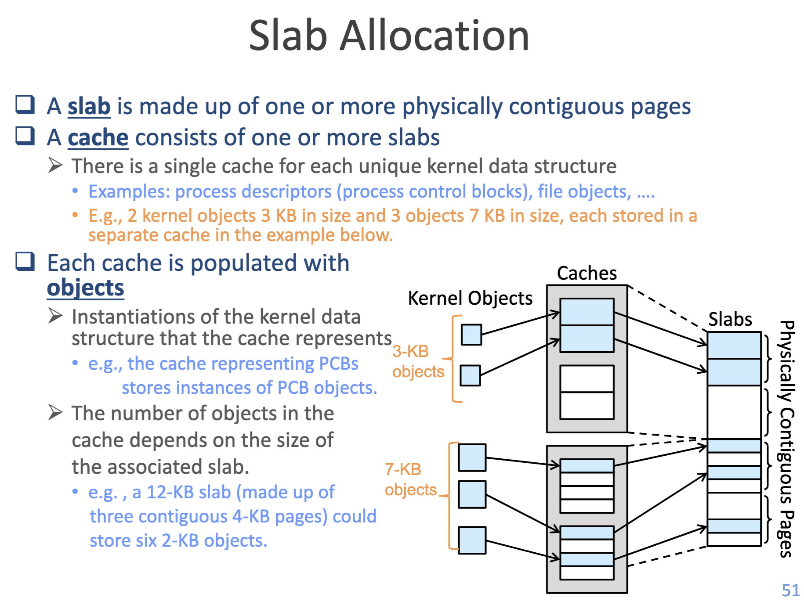
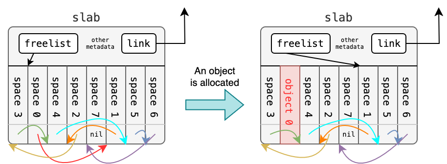
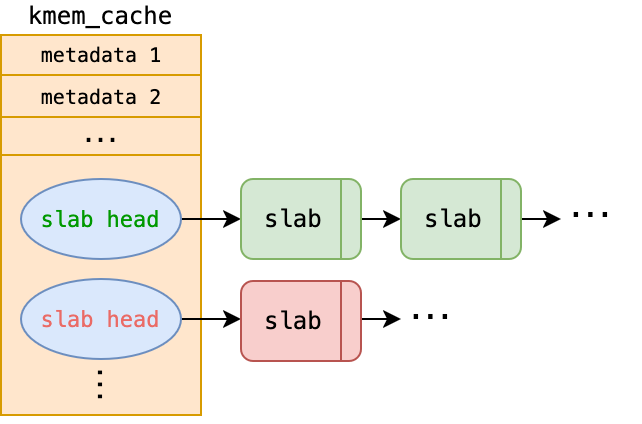
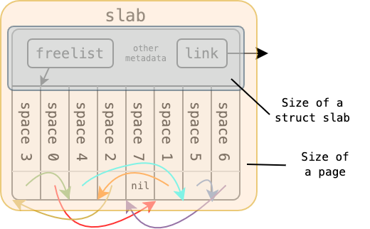
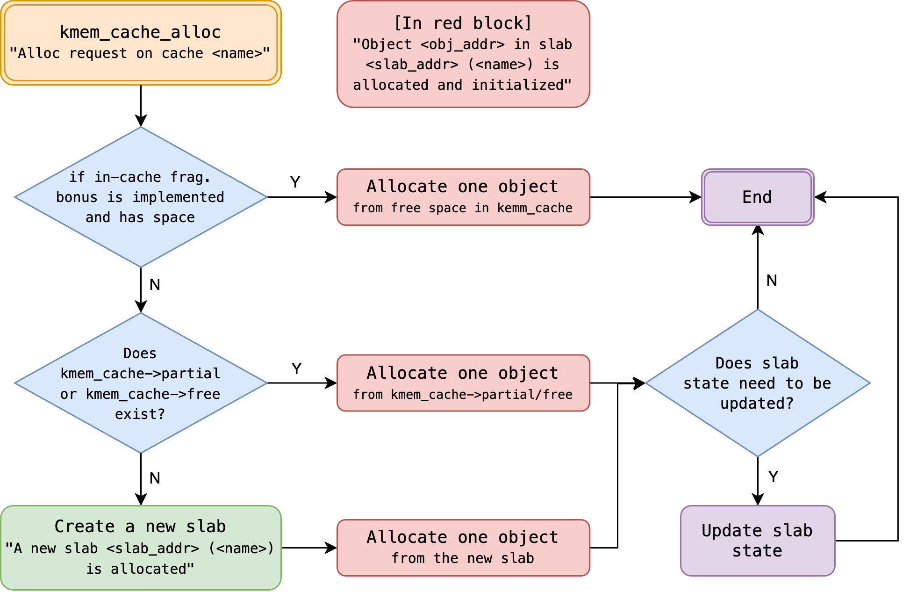
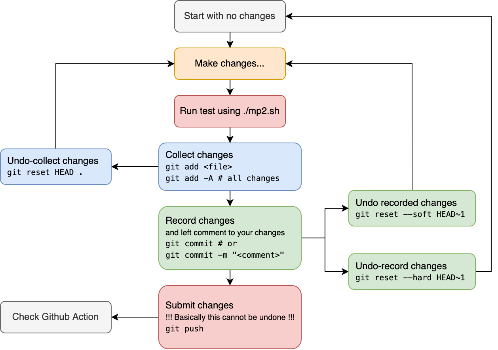
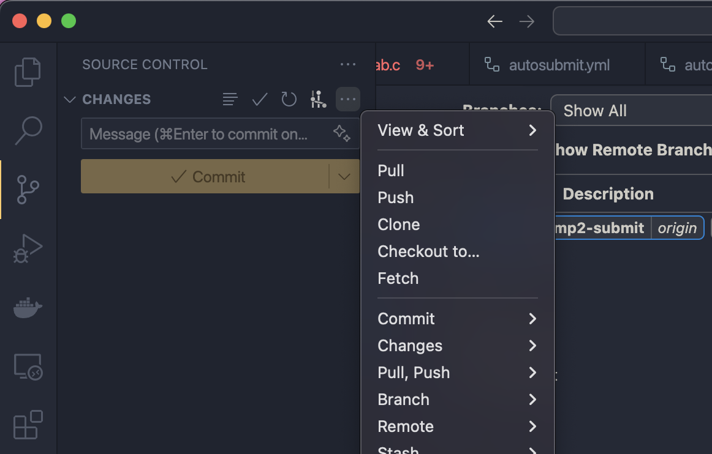

# MP2 Memory Management: Kernel Memory Allocation (slab)

## Basic Information

* Full Score: 125% (Basic: 100%, Bonus: 25%)
* Release Date: March 18, 2025
* Due Date: April 3, 2025 23:59:59
* Late Submission Until: April 8, 2025 23:59:59
* TA Email: ntuos@googlegroups.com
* TA Hours: Wednesday 1:00–2:00 p.m., Friday 11:00 a.m.–12:00 p.m., at CSIE B04

[TOC]


## Overview

In the MP2 assignment, we will explore **memory allocation and deallocation mechanisms for small kernel objects** and require students to **design and implement a slab allocator** within the `xv6` operating system.

Key focuses of this assignment include:
- **Design of the slab allocator’s data structures**
- **Optimization of time and space efficiency for small object allocation**
- **Various optimization techniques related to slab**

Through this assignment, students will gain hands-on experience in **designing and implementing system memory management** and learn how to enhance the efficiency of kernel memory allocation.

## Environment Setup and Preparation

Please confirm the following steps to ensure your development environment is properly set up:

1. Ensure [Git](https://git-scm.com/) is installed.
2. Ensure you have a [GitHub account](https://github.com/). If not, please register first.
3. Through the following MP2 exclusive GitHub Classroom links, click **Accept this assignment**, and the system will create a dedicated assignment repository `mp2-<USERNAME>` for each student. Due to the large number of students in this course, it is divided into two classrooms. It is recommended to use the first link to join, and please do not join repeatedly.
   1. [Link 1 (Recommended)](https://classroom.github.com/a/8RRWnxeC)
   2. [Link 2](https://classroom.github.com/a/99lR2XaX)
4. Access your MP2 repository at `https://github.com/ntuos2025/mp2-<USERNAME>`.
5. Clone the repository locally:
    ```bash
    git clone https://github.com/ntuos2025/mp2-<USERNAME>
    ```
6. Enter your student ID in the `student_id.txt` file within the repository, for example:
    ```log
    b12345678
    ```
7. Run the `mp2.sh` MP2 script tool:
    ```bash
    ./mp2.sh setup  # Basic setup
    ```
    For additional usage details, run `./mp2.sh` to view them.
8. [Run functionality tests](#mp2sh-script-usage-guide) (public tests):
    ```bash
    ./mp2.sh test [case]  # See the appendix for more information
    ```
    Since the template code has not yet implemented the system call, the default compilation will not succeed.

# Grading Criteria and Submission Method

## Grading Criteria

The total score for this assignment is **125%**, comprising **basic requirements and bonus items**. It is recommended that students **complete the basic implementation first before attempting the bonus items**.

### Basic Requirements

- [slab Design](#struct-slab-design) (5%)
- Functionality Tests (Public Tests) (75%)
  - Includes 25 test cases, each worth 3%.
- Hidden Tests (Private Tests) (20%)
  - Includes 4 test cases, each worth 5%.

### Bonus Items

Bonus items do not conflict with the basic requirements and are independent of each other, allowing students to implement multiple items.

- [`struct slab` Memory Optimization](#struct-slab-design) (+5%)
- [`kmem_cache` Internal Fragmentation Optimization](#kmem_cache-internal-fragmentation-issue-bonus-item) (+10%)
- [Managing slab with `kernel/list.h`](#struct-slab-design) (+10%)

## Submission and Grading Method

This assignment introduces a fully automated submission and grading process. Students only need to push their code to GitHub, and the system will automatically perform grading and submit the results.

The grading consists of the following four tests, and students can view the execution results in the GitHub Actions section of their personal MP2 repository:

- **slab Structure Test** (5% + 5% bonus)
- **Functionality Test** (75%)
  - If the functionality test score exceeds 66 points, the following two bonus tests will be conducted; otherwise, the bonus item evaluation will be skipped:
    - **List API Test** (+10%)
    - **In-Cache Test** (+10%)
  - Note: This logic differs from the execution method of `./mp2.sh test all`. The latter is designed to allow students to test all cases in one go, regardless of their score.
- **Hidden Test** (20%)

Before the deadline, students may submit their code an unlimited number of times. The assignment will be automatically graded via pre-configured GitHub Actions once at 3/31 00:00:00, which will review the commit history and test results, with outcomes available for viewing on the GitHub Actions interface. Please note that when GitHub Actions completes and displays a green dot, it does not necessarily mean a full score has been achieved. To check your score, please view the details within GitHub Actions.

Final grading will automatically occur one week after the deadline (2025/04/10 00:00:00) and scores will be uploaded. Submissions are still accepted after the deadline (2025/04/03), but points will be deducted based on the number of days late, with a 20% reduction per day, dropping to 0% on the fifth day (2025/04/08). Students can check their final grading results on GitHub Actions after 2025/04/10.

Students are [required to strictly adhere to file modification rules](#file-modification-rules). To prevent accidental modification of restricted files during submission, it is recommended to run `./mp2.sh setup`, which activates a Git Hook to protect restricted files. After the deadline, teaching assistants will review submissions for any unauthorized modifications to restricted files. If violations are found, it will be considered cheating, and the assignment will be graded as 0 points. Additionally, if a student attempts to exploit security vulnerabilities to affect their own or others' scores, upon verification, it will be deemed cheating, and the assignment will be graded as 0 points.

# Problem Background: Challenges in Kernel Memory Management

Imagine the kernel needs to allocate 100 system objects of size `40B`, such as `struct file` in xv6. If each object is stored in a separate page, not only does this incur the overhead of page allocation, but it also leads to severe internal fragmentation, especially for small system objects.

By leveraging the fact that these system objects are of the same size, the kernel could pre-allocate one or more contiguous pages and divide their internal space into `40B` units. This approach maximizes page space utilization, reduces internal fragmentation, and speeds up allocation by reusing existing pages rather than allocating new ones, especially given the likelihood of repeated access to the same page in a short time.

> 
> Review the course slides.

The slab system, originating from SunOS source code, was used in early Linux kernels to manage memory allocation for small system objects. This assignment will guide students in **designing and implementing a new slab memory allocation system** to improve memory management efficiency for small objects like `struct file` in xv6.

On a side note, the lab where the MP2 TAs work is called NEWSLAB, which can be playfully split as "New Slab"—fittingly, the goal of MP2! Hopefully, this isn’t too cheesy.

# Preliminary Design and API of the slab Allocator

## Preliminary Design of the slab Allocator

The goals of the slab allocator design are:

1. Allocate pages for kernel objects of the same size.
2. Divide pages into fixed-size objects to improve memory utilization efficiency.

To simplify the design, **assume the kernel can only allocate a single page at a time**, not multiple contiguous pages. Based on this assumption, we define `struct slab`, which is the size of a single page and includes the object category name `name`, the size of each object `object_size`, and a `freelist` to manage available objects.

```c
struct slab {
    char name[MP2_CACHE_MAX_NAME];
    uint object_size;
    void **freelist;
    ...
};
```

In C, `void *` represents a pointer to any type but cannot be dereferenced directly due to its unspecified type, requiring a cast to a specific type for operations. `(void *) *freelist` denotes an array of `void *` pointers or a pointer to a `void *`. The detailed structure of `freelist` will be elaborated in [a later section](#freelist-data-structure).

Since `name` and `object_size` are identical for objects of the same type, we can design an additional structure, `struct kmem_cache`, above `struct slab` to manage shared information for objects of the same type, reducing the memory overhead of `struct slab`.

```c
struct slab {
    void **freelist;
    ... // Additional members can be added as needed
};

struct kmem_cache {
    char name[MP2_CACHE_MAX_NAME];
    uint object_size;
    struct slab *slab; // Tracks the currently used slab
    ... // Additional members can be added as needed
};
```

We expect these structures to provide the following four core functions:

```c
// Initialize a slab allocator to manage system objects named "name" with size "object_size"
struct kmem_cache *kmem_cache_create(char *name, uint object_size);

// Allocate a system object and return it
void *kmem_cache_alloc(struct kmem_cache *cache);

// Free a previously allocated system object "obj"
void kmem_cache_free(struct kmem_cache *cache, void *obj);

// Destroy the kmem_cache (not included in grading)
void kmem_cache_destroy(struct kmem_cache *cache);
```

Using these APIs, other kernel developers can manage memory as follows:

```c
// Initialize a slab allocator for struct file
struct kmem_cache *file_cache = kmem_cache_create("file", sizeof(struct file));

// Allocate a struct file object
struct file *file_allocated = (struct file *) kmem_cache_alloc(file_cache);

// Free a struct file object
kmem_cache_free(file_cache, file2release);

// Destroy the file_cache when no longer needed
kmem_cache_destroy(file_cache);
```

This is the interface design of the slab allocator in the MP2 assignment and the core objective of this implementation. In the following sections, we will delve into its specific implementation details.

## API Interface

This assignment requires providing the following slab APIs for use in the `xv6` kernel:

### 1. `kmem_cache_create`

```c
struct kmem_cache *kmem_cache_create(const char *name, size_t object_size);
```
- **Function**: Initialize a `kmem_cache` to manage objects of a specific size.
- **Parameters**:
  - `name`: Cache name (for debugging and management).
  - `object_size`: Object size (memory requirement of a single object).
- **Return Value**: Pointer to the newly created `kmem_cache`.

### 2. `kmem_cache_alloc`

```c
void *kmem_cache_alloc(struct kmem_cache *cache);
```
- **Function**: Obtain an available object from the `kmem_cache`.
- **Parameters**:
  - `cache`: Pointer to the `kmem_cache` structure.
- **Return Value**: Pointer to the allocated object on success; `NULL` on failure.

### 3. `kmem_cache_free`

```c
void kmem_cache_free(struct kmem_cache *cache, void *obj);
```
- **Function**: Return an object to the `kmem_cache` for future allocation.
- **Parameters**:
  - `cache`: Pointer to the `kmem_cache` structure.
  - `obj`: Pointer to the object to be freed.

# Considerations for Implementing the slab Allocator

## `freelist` Data Structure

After reading the above, you may be eager to implement the slab memory allocation mechanism in `xv6`. However, a key challenge in this process is **how to design the `freelist` data structure**.

First, `freelist` is essentially a contiguous memory region, i.e., **an array**. For any array, the time complexity of retrieving or releasing an element is typically $O(n)$, where $n$ is the maximum number of objects that can be stored in `freelist`. However, in a performance-critical kernel like Linux kernel, such high complexity is unacceptable. Thus, we need a **more suitable data structure** to optimize allocation and deallocation times.

## Application of Linked Lists

Readers familiar with data structures know that a **linked list** allows element removal and insertion in $O(1)$ time, making it ideal for implementing object allocation and deallocation—hence the name `freelist`. We can treat `freelist` as a linked list of unallocated objects and operate as follows:

- **Allocate an object**: Remove the first available object from `freelist` and update the `freelist` pointer.
- **Free an object**: Insert the freed object back into `freelist`.

This reduces the time complexity of both allocation and deallocation to **$O(1)$**, significantly improving performance.

## How to Create a Linked List in Contiguous Memory?

An intuitive approach is to **create an additional linked list to track available memory addresses in the array**. Suppose the original object array is `objects`, and `freelist` stores the addresses of available objects:

```c
struct slab {
    void **objects;
    void **freelist; // Linked list, initially recording addresses of all available objects
};
```

However, this design has two issues:

1. It requires extra memory to store the linked list nodes of `freelist`.
2. The memory allocation and management of `freelist` itself remain unresolved.

To address this, Linux kernel developers often use a C language technique of **interpreting memory differently**, directly using unallocated memory to store linked list pointers, maximizing the use of allocated memory. Specifically, **each unused object can store a pointer to the next available object**, forming a linked list. This concept is similar to the previous design but resolves both issues simultaneously.

Assuming the size of system objects is **at least as large as a pointer**, we can safely treat **unallocated objects as linked list nodes**. Here’s an example of `freelist` operation:

```c
struct slab {
    void **freelist;
    ...
};

struct slab *s = ...;
// Get the first available object
void *free_obj = s->freelist;
// The first pointer-sized space in `free_obj` stores the address of the next available object
void *next_free_obj = *(void **)free_obj;
// Reinterpret the memory as a specific system object (e.g., struct file)
struct file *f = (struct file *) free_obj;
struct file *f_next = (struct file *) next_free_obj;
```

Too many `void *` pointers confusing you? The `xv6` implementation in [`kernel/kalloc.c`](../kernel/kalloc.c) offers a more readable approach:

```c
// in kalloc.c
// struct run interprets a memory block as a structure with a next member
struct run {
    struct run *next;
};

struct {
    struct spinlock lock;
    struct run *freelist;
} kmem;
```

This allows the earlier example to be rewritten equivalently as:

```c
struct slab {
    struct run *freelist;
    ...
};

struct slab *s = ...;
// Get the pointer to the first available object
struct run *r = s->freelist;
// The `next` member in the first available object contains the address of the next available object
struct run *r_next = r->next;
// Reinterpret the memory as a specific system object (e.g., struct file)
struct file *f = (struct file *) r;
struct file *f_after_f = (struct file *) r_next;
```

Students may also place two pointers within a kernel object’s space to implement a doubly linked list. Please design an appropriate data structure for `freelist` based on the [slab allocator implementation requirements](#implementation-requirements).

## Number of Elements in `freelist`

For a slab occupying one page, the number of elements in `freelist` should be:

$$
\frac{\text{Page size - Metadata size in a slab}}{\text{Size of each object}}
$$

## `kmem_cache` Data Structure

`kmem_cache` is the core structure in the slab allocator responsible for managing memory allocation for objects of the same type. Its initial form is:

```c
struct slab {
    <ptr> freelist;
    ... // Other fields can be extended as needed
};

struct kmem_cache {
    char name[MP2_CACHE_MAX_NAME];
    uint object_size;
    struct slab *slab; // Points to the currently used struct slab
    ... // Other fields can be extended as needed
};
```

Key considerations in system design include:

- The size of `struct kmem_cache` (and `struct slab`) is fixed at one page and cannot be dynamically adjusted.
- To improve memory allocation efficiency, `struct kmem_cache` should point to a list of slabs with available space. Common slab list categories are:
  - **Full**: All objects are allocated.
  - **Partial**: Some objects remain available.
  - **Free**: Unused slabs.
- **When all existing slabs are full, a new page should be allocated to create an additional slab**. Thus, while each `kmem_cache` corresponds to a single object type, the number of slabs it manages may vary dynamically with memory demand.

Since `kmem_cache` may need to manage a large number of slabs dynamically, designing `kmem_cache::slab` as an array is impractical. A **linked list** is more suitable. The design can be refined as:

```c
struct slab {
    <ptr> freelist;

    {   // slab list linkage pointers
        <ptr> <next>;
        <ptr> <prev>; // Optional, depending on situational needs
    }
    ... // Other fields can be extended as needed
};

struct kmem_cache {
    char name[MP2_CACHE_MAX_NAME];
    uint object_size;

    <ptr> full;    // Points to the list of full slabs
    <ptr> partial; // Points to the list of partially used slabs
    <ptr> free;    // Points to the list of free slabs

    ... // Other fields can be extended as needed
};
```

Here, `<ptr>` can be `struct slab *`, `void *`, or `struct list_head`, the latter being a Linux-style doubly linked list management approach provided in [`kernel/list.h`](../kernel/list.h). For usage details, refer to the documentation comments in that file. Students implementing slab lists with `struct list_head` from this library will have a bonus opportunity.

## Relationship Between Core Objects, `struct slab`, and `struct kmem_cache`

In the slab allocator for MP2, there are three key components whose relationships should be clearly understood.

### Kernel Objects

Kernel objects refer to the data structures managed by the kernel, such as `struct file`. Each kernel object has a fixed size.

### `struct slab`

- **Occupies a single page of memory**, where a portion of the space is allocated for **metadata**, while the remaining space is divided into equal-sized units, forming a **`freelist` (free object list)**. Each unit in the `freelist` can store one kernel object.  
- **Different types of kernel objects are managed in separate slabs**, ensuring independent management for different object types.  
- Based on the number of allocated objects, a `struct slab` can be categorized into three states:  
  - Full (`full`): All available objects have been allocated.  
  - Partially used (`partial`): Some objects have been allocated, but free space remains.  
  - Free (`free`): No objects have been allocated, and the slab is completely available for use.  
- **A "available slab" is defined as a slab in either the `partial` or `free` state**, meaning it still has available space for object allocation.  
- **Each `struct slab` is dynamically allocated as needed and is linked together in a list**, ensuring flexibility and scalability in memory management.  

  

The diagram above illustrates the state transition of a free slab before and after an object allocation. After allocation, the slab transitions into a partially used state.

In the function signature of `kmem_cache_free`, where only `struct kmem_cache *cache` and the core object pointer `void *obj` are provided, determining which `struct slab` the given `obj` belongs to is a critical design challenge. Consider what design approaches or techniques can be used to map `obj` to its corresponding `slab`.

### `struct kmem_cache`

- **Manages all slabs containing the same type of core object**, ensuring efficient memory allocation and deallocation.  
- **For example, the system may create a separate `kmem_cache` for `struct file` and `struct proc`**, each dedicated to managing the slabs for their respective objects. *(This assignment does not involve modifications to `struct proc`.)*  

  

As shown in the diagram, a `kmem_cache` may manage multiple metadata entries and maintain one or more linked lists of slabs.

### Relationship Between `freelist` and `slab`

To efficiently access the memory managed by `freelist`, it is essential to have a clear understanding of the memory layout of structures and pages. The diagram below illustrates the memory layout of a slab:  

  

Consider how to access the memory regions corresponding to each object in the diagram (`space 0 ~ 7`).  
Hint: [Pointer Arithmetic](https://www.open-std.org/jtc1/sc22/wg14/www/docs/n3220.pdf#subsection.6.5.7).

## Synchronization and Race Conditions in `kmem_cache`

In multi-core and multi-threaded environments, operations on `kmem_cache` involve modifying and managing slab lists, potentially leading to race conditions. When multiple CPUs access `kmem_cache` simultaneously—especially during object allocation (`kmem_cache_alloc()`) or deallocation (`kmem_cache_free()`)—data inconsistency or memory corruption may occur without proper synchronization.

To ensure thread safety in `kmem_cache`, appropriate synchronization mechanisms should be employed to protect critical sections. Common solutions include:

- **Spinlock**: Suitable for short-duration locking to avoid process-switching overhead.
- **Mutex**: For longer operations, reducing busy-waiting impact.
- **Per-CPU Cache**: Using a per-CPU `kmem_cache_cpu` to minimize cross-CPU lock contention, synchronizing globally only when necessary. This is a key optimization in the modern Linux kernel’s SLUB allocator, the successor to slab.

For this assignment, students need only use **spinlocks** to ensure `kmem_cache` thread safety. Below is an example of using `xv6`’s **spinlock** to ensure correctness in a multi-threaded environment:

```c
struct kmem_cache {
    ...
    struct spinlock lock;  // For synchronizing kmem_cache management
};

void some_func() {
    struct kmem_cache *cache = kmem_cache_create(...);

    // Enter critical section to prevent race conditions
    acquire(&cache->lock);
    
    // Critical operation that may cause contention
    cache->partial = NULL; 

    // Release lock, exit critical section
    release(&cache->lock);
}
```

When implementing the slab functionality and applying it to `file.c`, please be cautious in handling synchronization and race condition issues. Since the object we are replacing in `file.c`, the `ftable` object, contains `ftable::lock` to ensure the correct operation of `filealloc`, `filedup`, and `fileclose`, students can use `file_cache::lock` for the implementation.

In MP2, students are required to add `acquire` and `release` at the entry and exit points of the slab API-related functions, respectively, to ensure execution safety in the most conservative manner. An example is shown below.

```c
void some_api(struct kmem_cache *cache, ...)
{
    acquire(&cache->lock);

    if (...) {
        ...
        release(&cache->lock);
        return;
    }
    ...
    
    release(&cache->lock);
    return;
}
```

## `kmem_cache` Internal Fragmentation Issue (Bonus Item)

`struct kmem_cache` itself is a **dynamically allocated system object**, typically occupying **a full page**, but its own size is much smaller, leading to memory waste. To address this, the remaining space can be used to store allocatable objects within the slab.

To comply with the [implementation requirements](#print_kmem_cache-printing-struct-kmem_cache-information), please:  

- Treat `struct kmem_cache` as a slab with `<slab_type>` set to `cache`.  
- In the printed information, set `<slab_addr>` to the memory address of `struct kmem_cache` itself.  
- In the printed information, set `<nxt_slab_addr>` to `0x00...00` (all zeros).

# Prerequisite Information for Implementation

## File Modification Rules

- **Please ensure that you enter your student ID in the `student_id.txt` file.**  
- Restricted files **must not be modified**:  
  - **Restricted files**:  
    - `mp2.sh`  
    - `scripts/action_grader.h`  
    - `scripts/pre-commit`  
    - `kernel/main.c`  
    - `kernel/mp2_checker.h`  
    - `kernel/file.h`  
    - `kernel/list.h`  
    - `kernel/param.h`  
    - All code within the `.github/` directory  
    - All files within the `test/` directory, except `test/custom/mytest.txt`  
    - All existing files within the `user/` directory; students may additionally implement other user programs for testing purposes  
  - **Any modifications to restricted files will be considered a violation and will result in a zero score for this assignment.**  
  - Modifications to restricted files are permitted locally but must not be committed to Github.
- Beyond the above restrictions, students are free to add new files or modify other code.  
- Using `./mp2.sh setup` can automatically prevent students from attempting to submit problematic changes.

## Simple Kernel Debugger

Debugging newly added features in large-scale software projects is a challenging task. To facilitate this, many projects integrate logging or debugging systems to help developers diagnose issues. However, **xv6 only provides basic output functionality**, such as `printf`, which is limited in terms of debugging and testing capabilities. To improve debugging efficiency and testing flexibility, we have implemented a **simple kernel debugging system** for students to utilize.

This debugging system is fully compatible with the `printf` interface, supporting formatted output along with additional control options.

```c
// in file.c
#include "debug.h" // Include the kernel debugging tool
// Formatted output
debug("tp: %d, ref: %d, readable: %d, ...",
      file->type, file->ref, file->readable, ...);
// Standard string output
debug("[FILE] filealloc");
```

For this MP2 assignment, **all output must be handled using the `debug` macro function** to ensure compatibility with the testing and grading system. **Strict adherence to this requirement is mandatory** to prevent inconsistencies in test results, which may affect grading.

For detailed usage instructions, please refer to the [`kernel/debug.h`](../kernel/debug.h) documentation.

## Dynamic Debugging Mode Switching

The `debugswitch` command is provided by us in `xv6`, allowing developers to **toggle debugging mode via the command line**. Running `debugswitch` will **switch between enabling and disabling debug output**, making it easier to conduct tests and diagnose issues.

Example execution of `debugswitch`:
```sh
xv6 kernel is booting

[FILE] fileinit
hart 2 starting
hart 1 starting
[FILE] filealloc
init: starting sh
[FILE] filealloc
[FILE] fileclose
$ debugswitch
Switch debug mode to 0
$ ls
.              1 1 1024
..             1 1 1024
README         2 2 2292
cat            2 3 34728
...
console        3 22 0
$ debugswitch
Switch debug mode to 1
$ ls
[FILE] filealloc
[FILE] filealloc
[FILE] fileclose
.              1 1 1024
[FILE] filealloc
[FILE] fileclose
..             1 1 1024
[FILE] filealloc
[FILE] fileclose
README         2 2 2292
...
[FILE] filealloc
[FILE] fileclose
console        3 22 0
[FILE] fileclose
```

# Implementation Requirements

This assignment offers students significant flexibility to customize the `slab` design, provided the following specifications are followed.

## `struct slab` Design

Design the `struct slab` data structure. Since kernel developers typically aim to maximize memory utilization, students are encouraged to minimize `struct slab`’s memory footprint to enhance space efficiency.

```c
struct slab {
    <ptr> freelist;

    {
        <ptr> <next>;
        <ptr> <prev>;
    }
    ... // Students may extend as needed
};
```

The `struct slab` design will be graded based on three criteria:

1. `struct slab` Memory Size (Up to 8%)
   Define the size factor $v(s)$ as:
   $$
   v(s) = \frac{\text{sizeof(struct slab)}}{\text{sizeof(void *)}}
   $$
   Grading scale:

   | `v(s)` | Score |
   |--------|-------|
   | $\le$ 3 | 3% + 5% |
   | 4      | 3% + 2% |
   | 5      | 3%      |
   | 6      | 2%      |
   | 7      | 1%      |
   | $\ge$ 8 | 0%      |

2. **Number of Objects Accommodated in `slab::freelist` (2%)**  
   During testing, since the size of a `struct file` is 504 Bytes, a single page should ideally accommodate up to 8 `struct file` objects. The grading criteria are as follows:

   | Number of `struct file` Objects Accommodated | Score |
   |---------------------------------------------|-------|
   | 8                                           | 2%    |
   | 7                                           | 1%    |
   | $\le$ 6                                     | 0%    |

   Additionally, for the bonus section related to internal fragmentation, the number of objects allocated using the remaining space in `struct kmem_cache` does not affect the scoring of this part.

3. Using `struct list_head` for slab Management (Bonus +10%)
   - Must use [`struct list_head`](../kernel/list.h) in `struct slab` to maintain inter-slab linkage.
   - Over 66 score in functionality tests are required to earn this additional 10 points.

## `struct kmem_cache` Design

```c
struct kmem_cache {
    char name[MP2_CACHE_MAX_NAME];
    uint object_size;
    struct spinlock lock;

    <ptr> full;    // Full (optional)
    <ptr> partial; // Partially used
    <ptr> free;    // Free (optional)

    ... // Students may extend as needed
};
```

Key considerations:

1. **Free slab Release Mechanism**
   To reduce memory waste from excessive free slabs, when the total number of available slabs (`partial + free`) exceeds `MP2_MIN_AVAIL_SLAB` defined in [`param.h`](../kernel/param.h), and a new slab becomes fully free (`free`), memory of some free slab should be actively released. This will be tested via `kmem_cache_free`.

2. **Internal Fragmentation Optimization**
   Due to [internal fragmentation issues](#kmem_cache-internal-fragmentation-issue-bonus-item), allocating and freeing objects using `kmem_cache`’s internal space (setting their `<slab_addr>` to `kmem_cache`’s address) earns an additional **10%**.

3. **Optionality of `full` and `free`**

   `full` and `free` in `kmem_cache` are optional. Students may refer to [Linux Kernel SLUB design](https://github.com/torvalds/linux/blob/0fed89a961ea851945d23cc35beb59d6e56c0964/mm/slub.c#L154) or adopt other suitable methods, provided they meet [implementation specifications](#print_kmem_cache-printing-struct-kmem_cache-information).

## slab Functionality

Implement the following functions in [`slab.c`](./kernel/slab.c):

```c
// 1. Core slab Memory Management Functions
// 1-1. Initialize a slab allocator, creating a kmem_cache for system objects named "name" with size "object_size"
struct kmem_cache *kmem_cache_create(char *name, uint object_size);
// 1-2. Allocate a system object and return its memory address
void *kmem_cache_alloc(struct kmem_cache *cache);
// 1-3. Free the specified system object "obj"
void kmem_cache_free(struct kmem_cache *cache, void *obj);
// 1-4. Destroy the kmem_cache
void kmem_cache_destroy(struct kmem_cache *cache);

// 2. Debugging Function
void print_kmem_cache(struct kmem_cache *, void (*)(void *));
```

All slab memory management functions should use `[SLAB] ` as a prefix for output messages, e.g.:

```log
[SLAB] Alloc request on cache file
```

## `kmem_cache_create`: Creating `kmem_cache`

Before successfully creating and returning `kmem_cache`, output the following:

<pre style="border: 1px solid #e8e8e8;padding: 10px;border-radius: 4px;font-size: 6px;line-height: 1.5;overflow-x: auto;white-space: pre-wrap;"><code>[SLAB] New kmem_cache (name: &lt;name&gt;, object size: &lt;object_size&gt; bytes, at: &lt;kmem_cache_addr&gt;, max objects per slab: &lt;max_objs&gt;, support in cache obj: &lt;in_cache_obj&gt;) is created
</code></pre>

- **`<name>`**: Name of the new `kmem_cache` (`kmem_cache::name`).
- **`<object_size>`**: Size of objects within the `kmem_cache` (`kmem_cache::object_size`, in bytes).
- **`<kmem_cache_addr>`**: Memory address of `kmem_cache`.
- **`<max_objs>`**: Maximum number of objects within a `slab`.
- **`<in_cache_obj>`**: Whether it supports the internal allocation of objects in kmem_cache, i.e., whether a solution to the [internal fragmentation issue](#kmem_cache-internal-fragmentation-issue-bonus-item) is implemented. If implemented, it is the maximum number of objects inside kmem_cache; otherwise, it is `0`.

Additionally, in `kmem_cache_create`, a new slab should not be initialized; the allocation of a new slab should be implemented on demand during `kmem_cache_alloc`.

## `kmem_cache_alloc`: Allocating Objects

When allocating objects, follow the flowchart below and output corresponding information. Replace variables in **angle brackets (`<>`)** with actual values, ensuring each line is prefixed with `[SLAB] ` and words are separated by a single space.



- **`<name>`**: Name of the `kmem_cache` (`kmem_cache::name`).
- **`<slab_addr>`**: Memory address of the slab containing the object.
- **`<obj_addr>`**: Memory address of the allocated object.

The printing details are as follows:

- Before allocating an object  
    ```log
    [SLAB] Alloc request on cache <name>
    ```
- When creating a new slab  
    ```log
    [SLAB] A new slab <slab_addr> (<name>) is allocated
    ```
- When an object is allocated  
    ```log
    [SLAB] Object <obj_addr> in slab <slab_addr> (<name>) is allocated and initialized
    ```
    
In addition, students can also print other customized debug messages, as long as they do not conflict with the print format in the flowchart. As suggestion, one can print custom debug messages with other prefixes (such as lowercase `[slab]`, etc.).

## `kmem_cache_free`: Freeing Objects

When freeing objects, follow the flowchart below and output corresponding information. Ensure output complies with specifications, replacing variables in **angle brackets (`<>`)**, with all messages prefixed with `[SLAB] ` and words separated by a single space.


- **`<name>`**: Name of the `kmem_cache` (`kmem_cache::name`).
- **`<slab_addr>`**: Memory address of the slab containing the object.
- **`<obj_addr>`**: Memory address of the object to be freed.
- **`<before>`**: State of the object’s slab before freeing (`full/partial/free/cache`).
- **`<after>`**: State of the object’s slab after freeing (`full/partial/free/cache`).

The printing details are as follows:

- Before freeing an object  
    ```log
    [SLAB] Free <obj_addr> in slab <slab_addr> (<name>)
    ```
- When freeing an empty slab  
    ```log
    [SLAB] slab <slab_addr> (<name>) is freed due to save memory
    ```
- When the function ends  
    ```log
    [SLAB] End of free
    ```

Additionally, if **the number of (`partial` + `free`) slabs exceeds `MP2_MIN_AVAIL_SLAB`** and the object’s slab becomes fully free (`free`), release the slab to reclaim memory. Also, students can also print other customized debug messages, as long as they do not conflict with the print format in the flowchart. As suggestion, one can print custom debug messages with other prefixes (such as lowercase `[slab]`, etc.).

## Applying the slab Allocator to `struct file` Management

In xv6, `struct file` was originally managed by `ftable` in `file.c`. Replace it with `struct kmem_cache *file_cache` and adjust `file.c` accordingly.

The following code has been added to `file.[h,c]` for you:

```c
// file.h
#include "kernel/param.h"
#include "kernel/slab.h"

struct file {
    ...
#ifdef MP2_TEST
  int fat_element[MP2_FILE_MAGIC_N];
#endif // _MP2_TEST_
};

extern struct kmem_cache *file_cache;
// Print file object metadata
void fileprint_metadata(void *f);

// file.c
#include "kernel/debug.h"
void fileprint_metadata(void *f) {
  struct file *file = (struct file *) f;
  debug("tp: %d, ref: %d, readable: %d, writable: %d, pipe: %p, ip: %p, off: %d, major: %d",
         file->type, file->ref, file->readable, file->writable, file->pipe, file->ip, file->off, file->major);
}

struct kmem_cache *file_cache;
```

## `print_kmem_cache`: Printing `struct kmem_cache` Information

When printing `struct kmem_cache`, `struct slab` should be categorized into `<slab_type>` (e.g., `full`, `partial`, etc.) based on the number of remaining allocatable objects. 

The output is divided into five categories:  

### 1. `<kmem_cache_status>`: Basic Information of `kmem_cache`  

<pre style="border: 1px solid #e8e8e8;padding: 10px;border-radius: 4px;font-size: 8px;line-height: 1.5;overflow-x: auto;white-space: pre-wrap;"><code>[SLAB] kmem_cache { name: &lt;name&gt;, object_size: &lt;object_size&gt;, at: &lt;kmem_cache_addr&gt;, in_cache_obj: &lt;in_cache_obj&gt; }
</code></pre>

- `<name>`: The name of the `kmem_cache` (corresponding to `kmem_cache::name`).
- `<object_size>`: The size of each object in the `kmem_cache` (corresponding to `kmem_cache::object_size`).
- `<in_cache_obj>`: Whether the [internal fragmentation issue](#kmem_cache-internal-fragmentation-issue-bonus-item) is implemented; if yes, it is the maximum number of objects inside kmem_cache, otherwise it is `0`.

### 2. `<slab_list_status>`: slab List Status  
```log
[SLAB] <SPACE>[ <slab_type><SPACE>slabs ]
```
- `<SPACE>`: One or more spaces `" "` or `"\t"`.
- `<slab_type>`: The type of the slab, which can be `full`, `partial`, `free`, or [`cache`](#kmem_cache-internal-fragmentation-issue-bonus-item).
- **`full` and `free` slabs can be inferred and thus do not need to be printed.**  

### 3. `<slab_status>`: Status of a Single slab  
```log
[SLAB] <SPACE>[ slab <slab_addr> ] { freelist: <freelist>, nxt: <next_slab_addr> }
```
- `<SPACE>`: One or more spaces `" "` or `"\t"`.
- `<slab_addr>`: The memory address of the slab.
- `<freelist>`: The starting address of the `freelist` within the slab.
- `<nxt_slab_addr>`: The memory address of the next slab in the linked list. 

### 4. `<obj_status>`: Status of a Core Object  
```log
[SLAB] <SPACE>[ idx <idx> ] { addr: <entry_addr>, as_ptr: <as_ptr>, as_obj: {<as_obj>} }
```
- `<SPACE>`: One or more spaces `" "` or `"\t"`.
- `<idx>`: The index of the object within its slab, ordered by ascending memory address.
- `<entry_addr>`: The memory address of the object, printed in the order defined by `slab::freelist`.
- `<as_ptr>`: The value obtained by interpreting the object as a pointer.
- `<as_obj>`: The output of interpreting the object as a system object (processed by `slab_obj_printer`).

### 5. `<print_kmem_cache_end>` Ending Mark

```log
[SLAB] print_kmem_cache end
```

### Output Format Example  
```log
[SLAB] <kmem_cache_status>
[SLAB] <slab_list_status 0>
[SLAB] <slab_status 0>
[SLAB] <obj_status 0>
[SLAB] <obj_status 1>
[SLAB] ...
[SLAB] <obj_status n>
[SLAB] <slab_status 1>
[SLAB] <obj_status 0>
[SLAB] <obj_status 1>
[SLAB] ...
[SLAB] <obj_status n>
[SLAB] <slab_list_status 1>
[SLAB] <slab_status 0>
[SLAB] <obj_status 0>
[SLAB] <obj_status 1>
[SLAB] ...
[SLAB] <obj_status n>
[SLAB] <slab_status 1>
[SLAB] <obj_status 0>
[SLAB] <obj_status 1>
[SLAB] ...
[SLAB] <obj_status n>
[SLAB] ...
[SLAB] ...
[SLAB] ...
[SLAB] <print_kmem_cache_end>
```

Example:

<pre style="border: 1px solid #e8e8e8;padding: 10px;border-radius: 4px;font-size: 5.2px;line-height: 1.5;overflow-x: auto;white-space: pre-wrap;"><code>[SLAB] kmem_cache { name: file, object_size: 504, at: 0x0000000087f59000, in_cache_obj: 0 }
[SLAB]    [ partial slabs ]
[SLAB]        [ slab 0x0000000087f4e000 ] { freelist: 0x0000000087f4e218, in_use: 1, nxt: 0x0000000087f59040 }
[SLAB]           [ idx 0 ] { addr: 0x0000000087f4e020, as_ptr: 0x0000000900000003, as_obj: { tp: 3, ref: 9, readable: 1, writable: 1, pipe: 0x0000000000000000, ip: 0x00000000800354c8, off: 0, major: 1 } }
[SLAB]           [ idx 1 ] { addr: 0x0000000087f4e218, as_ptr: 0x0000000087f4e410, as_obj: { tp: -2013993968, ref: 0, readable: 1, writable: 0, pipe: 0x0000000000000000, ip: 0x0000000080035440, off: 1024, major: 0 } }
[SLAB]           [ idx 2 ] { addr: 0x0000000087f4e410, as_ptr: 0x0000000087f4e608, as_obj: { tp: -2013993464, ref: 0, readable: 1, writable: 0, pipe: 0x0000000000000000, ip: 0x00000000800354c8, off: 0, major: 1 } }
[SLAB]           [ idx 3 ] { addr: 0x0000000087f4e608, as_ptr: 0x0000000087f4e800, as_obj: { tp: -2013992960, ref: 0, readable: 5, writable: 5, pipe: 0x0505050505050505, ip: 0x0505050505050505, off: 84215045, major: 1285 } }
[SLAB]           [ idx 4 ] { addr: 0x0000000087f4e800, as_ptr: 0x0000000087f4e9f8, as_obj: { tp: -2013992456, ref: 0, readable: 5, writable: 5, pipe: 0x0505050505050505, ip: 0x0505050505050505, off: 84215045, major: 1285 } }
[SLAB]           [ idx 5 ] { addr: 0x0000000087f4e9f8, as_ptr: 0x0000000087f4ebf0, as_obj: { tp: -2013991952, ref: 0, readable: 5, writable: 5, pipe: 0x0505050505050505, ip: 0x0505050505050505, off: 84215045, major: 1285 } }
[SLAB]           [ idx 6 ] { addr: 0x0000000087f4ebf0, as_ptr: 0x0000000087f4ede8, as_obj: { tp: -2013991448, ref: 0, readable: 5, writable: 5, pipe: 0x0505050505050505, ip: 0x0505050505050505, off: 84215045, major: 1285 } }
[SLAB]           [ idx 7 ] { addr: 0x0000000087f4ede8, as_ptr: 0x0000000000000000, as_obj: { tp: 0, ref: 0, readable: 5, writable: 5, pipe: 0x0505050505050505, ip: 0x0505050505050505, off: 84215045, major: 1285 } }
[SLAB] print_kmem_cache end
</code></pre>

<pre style="border: 1px solid #e8e8e8;padding: 10px;border-radius: 4px;font-size: 5.2px;line-height: 1.5;overflow-x: auto;white-space: pre-wrap;"><code>[SLAB] kmem_cache { name: file, object_size: 504, at: 0x0000000087f59000, in_cache_obj: 0 }
[SLAB]    [ partial slabs ]
[SLAB]        [ slab 0x0000000087e5d000 ] { freelist: 0x0000000087e5d020, in_use: 0, nxt: 0x0000000087f4e008 }
[SLAB]           [ idx 0 ] { addr: 0x0000000087e5d020, as_ptr: 0x0000000087e5d410, as_obj: { tp: -2014981104, ref: 0, readable: 1, writable: 0, pipe: 0x0000000000000000, ip: 0x0000000080035440, off: 1024, major: 0 } }
[SLAB]           [ idx 1 ] { addr: 0x0000000087e5d218, as_ptr: 0x0000000000000000, as_obj: { tp: 0, ref: 0, readable: 0, writable: 1, pipe: 0x0000000087e5c000, ip: 0x0000000000000000, off: 0, major: 0 } }
[SLAB]           [ idx 2 ] { addr: 0x0000000087e5d410, as_ptr: 0x0000000087e5d800, as_obj: { tp: -2014980096, ref: 0, readable: 1, writable: 0, pipe: 0x0000000000000000, ip: 0x0000000080035550, off: 0, major: 0 } }
[SLAB]           [ idx 3 ] { addr: 0x0000000087e5d608, as_ptr: 0x0000000087e5d218, as_obj: { tp: -2014981608, ref: 0, readable: 0, writable: 1, pipe: 0x0000000087e20000, ip: 0x0000000000000000, off: 0, major: 0 } }
[SLAB]           [ idx 4 ] { addr: 0x0000000087e5d800, as_ptr: 0x0000000087e5dbf0, as_obj: { tp: -2014979088, ref: 0, readable: 1, writable: 0, pipe: 0x0000000087de5000, ip: 0x0000000000000000, off: 0, major: 0 } }
[SLAB]           [ idx 5 ] { addr: 0x0000000087e5d9f8, as_ptr: 0x0000000087e5d608, as_obj: { tp: -2014980600, ref: 0, readable: 0, writable: 1, pipe: 0x0000000087de5000, ip: 0x0000000000000000, off: 0, major: 0 } }
[SLAB]           [ idx 6 ] { addr: 0x0000000087e5dbf0, as_ptr: 0x0000000087e5dde8, as_obj: { tp: -2014978584, ref: 0, readable: 1, writable: 0, pipe: 0x0000000087daa000, ip: 0x0000000000000000, off: 0, major: 0 } }
[SLAB]           [ idx 7 ] { addr: 0x0000000087e5dde8, as_ptr: 0x0000000087e5d9f8, as_obj: { tp: -2014979592, ref: 0, readable: 0, writable: 1, pipe: 0x0000000000000000, ip: 0x00000000800355d8, off: 5, major: 0 } }
[SLAB]        [ slab 0x0000000087f4e000 ] { freelist: 0x0000000087f4e218, in_use: 1, nxt: 0x0000000087f59040 }
[SLAB]           [ idx 0 ] { addr: 0x0000000087f4e020, as_ptr: 0x0000000900000003, as_obj: { tp: 3, ref: 9, readable: 1, writable: 1, pipe: 0x0000000000000000, ip: 0x00000000800354c8, off: 0, major: 1 } }
[SLAB]           [ idx 1 ] { addr: 0x0000000087f4e218, as_ptr: 0x0000000087f4e608, as_obj: { tp: -2013993464, ref: 0, readable: 1, writable: 0, pipe: 0x0000000087f42000, ip: 0x0000000000000000, off: 0, major: 0 } }
[SLAB]           [ idx 2 ] { addr: 0x0000000087f4e410, as_ptr: 0x0000000087f4ebf0, as_obj: { tp: -2013991952, ref: 0, readable: 1, writable: 0, pipe: 0x0000000087eeb000, ip: 0x0000000000000000, off: 0, major: 0 } }
[SLAB]           [ idx 3 ] { addr: 0x0000000087f4e608, as_ptr: 0x0000000087f4e410, as_obj: { tp: -2013993968, ref: 0, readable: 1, writable: 0, pipe: 0x0000000087ee5000, ip: 0x0000000000000000, off: 0, major: 0 } }
[SLAB]           [ idx 4 ] { addr: 0x0000000087f4e800, as_ptr: 0x0000000087f4e9f8, as_obj: { tp: -2013992456, ref: 0, readable: 0, writable: 1, pipe: 0x0000000000000000, ip: 0x00000000800355d8, off: 5, major: 0 } }
[SLAB]           [ idx 5 ] { addr: 0x0000000087f4e9f8, as_ptr: 0x0000000000000000, as_obj: { tp: 0, ref: 0, readable: 0, writable: 1, pipe: 0x0000000087eeb000, ip: 0x0000000000000000, off: 0, major: 0 } }
[SLAB]           [ idx 6 ] { addr: 0x0000000087f4ebf0, as_ptr: 0x0000000087f4ede8, as_obj: { tp: -2013991448, ref: 0, readable: 1, writable: 0, pipe: 0x0000000087e98000, ip: 0x0000000000000000, off: 0, major: 0 } }
[SLAB]           [ idx 7 ] { addr: 0x0000000087f4ede8, as_ptr: 0x0000000087f4e800, as_obj: { tp: -2013992960, ref: 0, readable: 0, writable: 1, pipe: 0x0000000000000000, ip: 0x0000000080035550, off: 5, major: 0 } }
[SLAB] print_kmem_cache end
</code></pre>

<pre style="border: 1px solid #e8e8e8;padding: 10px;border-radius: 4px;font-size: 5.2px;line-height: 1.5;overflow-x: auto;white-space: pre-wrap;"><code>[SLAB] kmem_cache { name: file, object_size: 504, at: 0x0000000087f59000, in_cache_obj: 7 }
[SLAB]    [ cache    slabs ]
[SLAB]        [ slab 0x0000000087f59000 ] { freelist: 0x0000000087f59268, nxt: 0x0000000000000000 }
[SLAB]           [ idx 0 ] { addr: 0x0000000087f59070, as_ptr: 0x0000000900000003, as_obj: { tp: 3, ref: 9, readable: 1, writable: 1, pipe: 0x0505050505050505, ip: 0x00000000800355a8, off: 84215045, major: 1 } }
[SLAB]           [ idx 1 ] { addr: 0x0000000087f59268, as_ptr: 0x0000000087f59460, as_obj: { tp: -2013948832, ref: 0, readable: 1, writable: 0, pipe: 0x0505050505050505, ip: 0x0000000080035520, off: 1024, major: 1 } }
[SLAB]           [ idx 2 ] { addr: 0x0000000087f59460, as_ptr: 0x0000000087f59658, as_obj: { tp: -2013948328, ref: 0, readable: 1, writable: 0, pipe: 0x0505050505050505, ip: 0x00000000800355a8, off: 0, major: 1 } }
[SLAB]           [ idx 3 ] { addr: 0x0000000087f59658, as_ptr: 0x0000000087f59850, as_obj: { tp: -2013947824, ref: 0, readable: 5, writable: 5, pipe: 0x0505050505050505, ip: 0x0505050505050505, off: 84215045, major: 1285 } }
[SLAB]           [ idx 4 ] { addr: 0x0000000087f59850, as_ptr: 0x0000000087f59a48, as_obj: { tp: -2013947320, ref: 0, readable: 5, writable: 5, pipe: 0x0505050505050505, ip: 0x0505050505050505, off: 84215045, major: 1285 } }
[SLAB]           [ idx 5 ] { addr: 0x0000000087f59a48, as_ptr: 0x0000000087f59c40, as_obj: { tp: -2013946816, ref: 0, readable: 5, writable: 5, pipe: 0x0505050505050505, ip: 0x0505050505050505, off: 84215045, major: 1285 } }
[SLAB]           [ idx 6 ] { addr: 0x0000000087f59c40, as_ptr: 0x0000000000000000, as_obj: { tp: 0, ref: 0, readable: 5, writable: 5, pipe: 0x0505050505050505, ip: 0x0505050505050505, off: 84215045, major: 1285 } }
[SLAB] print_kmem_cache end
</code></pre>

<pre style="border: 1px solid #e8e8e8;padding: 10px;border-radius: 4px;font-size: 5.2px;line-height: 1.5;overflow-x: auto;white-space: pre-wrap;"><code>[SLAB] kmem_cache { name: file, object_size: 504, at: 0x0000000087f59000, in_cache_obj: 7 }
[SLAB]    [ cache    slabs ]
[SLAB]        [ slab 0x0000000087f59000 ] { freelist: 0x0000000087f59268, nxt: 0x0000000000000000 }
[SLAB]           [ idx 0 ] { addr: 0x0000000087f59070, as_ptr: 0x0000000900000003, as_obj: { tp: 3, ref: 9, readable: 1, writable: 1, pipe: 0x0505050505050505, ip: 0x0000000080035558, off: 84215045, major: 1 } }
[SLAB]           [ idx 1 ] { addr: 0x0000000087f59268, as_ptr: 0x0000000087f59658, as_obj: { tp: -2013948328, ref: 0, readable: 1, writable: 0, pipe: 0x0000000087f43000, ip: 0x00000000800354d0, off: 1024, major: 1 } }
[SLAB]           [ idx 2 ] { addr: 0x0000000087f59460, as_ptr: 0x0000000087f59850, as_obj: { tp: -2013947824, ref: 0, readable: 1, writable: 0, pipe: 0x0000000087e19000, ip: 0x0000000080035558, off: 0, major: 1 } }
[SLAB]           [ idx 3 ] { addr: 0x0000000087f59658, as_ptr: 0x0000000087f59a48, as_obj: { tp: -2013947320, ref: 0, readable: 1, writable: 0, pipe: 0x0000000087eec000, ip: 0x00000000800355e0, off: 0, major: 1 } }
[SLAB]           [ idx 4 ] { addr: 0x0000000087f59850, as_ptr: 0x0000000087f59c40, as_obj: { tp: -2013946816, ref: 0, readable: 0, writable: 1, pipe: 0x0000000087eec000, ip: 0x0000000080035668, off: 5, major: 1285 } }
[SLAB]           [ idx 5 ] { addr: 0x0000000087f59a48, as_ptr: 0x0000000087f59460, as_obj: { tp: -2013948832, ref: 0, readable: 1, writable: 0, pipe: 0x0000000087ead000, ip: 0x0505050505050505, off: 84215045, major: 1285 } }
[SLAB]           [ idx 6 ] { addr: 0x0000000087f59c40, as_ptr: 0x0000000000000000, as_obj: { tp: 0, ref: 0, readable: 0, writable: 1, pipe: 0x0000000087ead000, ip: 0x00000000800355e0, off: 5, major: 1285 } }
[SLAB]    [ partial slabs ]
[SLAB]        [ slab 0x0000000087e74000 ] { freelist: 0x0000000087e74020, nxt: 0x0000000087da2008 }
[SLAB]           [ idx 0 ] { addr: 0x0000000087e74020, as_ptr: 0x0000000087e74410, as_obj: { tp: -2014886896, ref: 0, readable: 1, writable: 0, pipe: 0x0000000087e73000, ip: 0x0000000000000000, off: 0, major: 0 } }
[SLAB]           [ idx 1 ] { addr: 0x0000000087e74218, as_ptr: 0x0000000000000000, as_obj: { tp: 0, ref: 0, readable: 0, writable: 1, pipe: 0x0000000087e73000, ip: 0x0000000000000000, off: 0, major: 0 } }
[SLAB]           [ idx 2 ] { addr: 0x0000000087e74410, as_ptr: 0x0000000087e749f8, as_obj: { tp: -2014885384, ref: 0, readable: 1, writable: 0, pipe: 0x0000000087f34000, ip: 0x0000000000000000, off: 0, major: 0 } }
[SLAB]           [ idx 3 ] { addr: 0x0000000087e74608, as_ptr: 0x0000000087e74218, as_obj: { tp: -2014887400, ref: 0, readable: 0, writable: 1, pipe: 0x0000000087f34000, ip: 0x0000000000000000, off: 0, major: 0 } }
[SLAB]           [ idx 4 ] { addr: 0x0000000087e74800, as_ptr: 0x0000000087e74608, as_obj: { tp: -2014886392, ref: 0, readable: 0, writable: 1, pipe: 0x0000000087e19000, ip: 0x0000000000000000, off: 0, major: 0 } }
[SLAB]           [ idx 5 ] { addr: 0x0000000087e749f8, as_ptr: 0x0000000087e74de8, as_obj: { tp: -2014884376, ref: 0, readable: 1, writable: 0, pipe: 0x0000000087ddd000, ip: 0x0000000000000000, off: 0, major: 0 } }
[SLAB]           [ idx 6 ] { addr: 0x0000000087e74bf0, as_ptr: 0x0000000087e74800, as_obj: { tp: -2014885888, ref: 0, readable: 0, writable: 1, pipe: 0x0000000000000000, ip: 0x0000000080035778, off: 5, major: 0 } }
[SLAB]           [ idx 7 ] { addr: 0x0000000087e74de8, as_ptr: 0x0000000087e74bf0, as_obj: { tp: -2014884880, ref: 0, readable: 1, writable: 0, pipe: 0x0000000087da1000, ip: 0x0000000000000000, off: 0, major: 0 } }
[SLAB]        [ slab 0x0000000087da2000 ] { freelist: 0x0000000087da2218, nxt: 0x0000000087f59040 }
[SLAB]           [ idx 0 ] { addr: 0x0000000087da2020, as_ptr: 0x0000000087da2de8, as_obj: { tp: -2015744536, ref: 0, readable: 0, writable: 1, pipe: 0x0000000087da1000, ip: 0x0000000000000000, off: 0, major: 0 } }
[SLAB]           [ idx 1 ] { addr: 0x0000000087da2218, as_ptr: 0x0000000087da2608, as_obj: { tp: -2015746552, ref: 0, readable: 1, writable: 0, pipe: 0x0000000087ee6000, ip: 0x0000000000000000, off: 0, major: 0 } }
[SLAB]           [ idx 2 ] { addr: 0x0000000087da2410, as_ptr: 0x0000000087da2020, as_obj: { tp: -2015748064, ref: 0, readable: 0, writable: 1, pipe: 0x0000000087ee6000, ip: 0x0000000000000000, off: 0, major: 0 } }
[SLAB]           [ idx 3 ] { addr: 0x0000000087da2608, as_ptr: 0x0000000087da29f8, as_obj: { tp: -2015745544, ref: 0, readable: 1, writable: 0, pipe: 0x0000000087d99000, ip: 0x0000000000000000, off: 0, major: 0 } }
[SLAB]           [ idx 4 ] { addr: 0x0000000087da2800, as_ptr: 0x0000000087da2410, as_obj: { tp: -2015747056, ref: 0, readable: 0, writable: 1, pipe: 0x0000000087d99000, ip: 0x0000000000000000, off: 0, major: 0 } }
[SLAB]           [ idx 5 ] { addr: 0x0000000087da29f8, as_ptr: 0x0000000087da2bf0, as_obj: { tp: -2015745040, ref: 0, readable: 1, writable: 0, pipe: 0x0000000087d48000, ip: 0x0000000000000000, off: 0, major: 0 } }
[SLAB]           [ idx 6 ] { addr: 0x0000000087da2bf0, as_ptr: 0x0000000087da2800, as_obj: { tp: -2015746048, ref: 0, readable: 0, writable: 1, pipe: 0x0000000087d48000, ip: 0x0000000000000000, off: 0, major: 0 } }
[SLAB]           [ idx 7 ] { addr: 0x0000000087da2de8, as_ptr: 0x0000000000000000, as_obj: { tp: 0, ref: 0, readable: 0, writable: 1, pipe: 0x0000000000000000, ip: 0x00000000800355e0, off: 5, major: 0 } }
[SLAB] print_kmem_cache end
</code></pre>

## Implementing System Call `sys_printfslab`

Implement `sys_printfslab` to print the slab (`struct kmem_cache`) for `file` as a system call.

Ensure the following user program runs correctly:

```c
#include "kernel/types.h"
#include "user/user.h"

int main(int argc, char *argv[])
{
  printfslab();
}
```

This code earns points if it compiles successfully, regardless of whether it prints the correct slab information. By default, it cannot yet compile.

## Code Structure Introduction

The template code for the MP2 assignment is based on [mit-pdos/xv6-riscv](https://github.com/mit-pdos/xv6-riscv), consistent with MP0 and MP1. It includes the `Makefile`, `kernel/`, and `user/` directories, which contain the kernel and user programs, respectively, as well as `mkfs/` for building the file system. On top of this, the teaching assistants have added:

- `student_id.txt`: A file to assist with grading; please ensure you fill in your student ID.
- `mp2.sh`: A tool for managing the MP2 assignment.
- `doc/`: Specification requirements for this MP2 assignment in both Chinese and English (Markdown + PDF).
- `scripts/`: Various helper scripts.
- `test/`: A testing system based on the original source code’s `Makefile`.
- `.github/`: Code related to GitHub Actions.

When testing, students can use the kernel’s command-line interface (`make qemu`) as in MP0 and MP1, or utilize the script tools provided by the teaching assistants. If you choose to use them, we recommend using [`./mp2.sh`](../mp2.sh) as the interface for invoking the testing system.

## Testing and Grading Framework

### Testing Framework

`./mp2.sh` serves as the interface for the testing framework. It prepares the container environment as needed and passes compliant parameters to `run_mp2.py`. The latter depends on `gradelib.py`, which compiles and runs the xv6 kernel, captures the output for further processing, and records the test scores.

After `run_mp2.py` retrieves the captured output, it calls the slab debug message interpreter `pseudo_fslab::interpreter` from `pseudo_fslab.cpython-39-x86_64-linux-gnu.so`. This interpreter continuously parses the output from `gradelib.py`, verifies whether each slab operation is logically sound, and throws an exception containing an error message back to `run_mp2.py` if an error occurs.

### Existing Test Items

#### slab Test

Executes the `mp2` command in `xv6`, examining the output generated by `mp2_checker.h/check()` during system boot and the results of the `mp2` command execution. Scores are calculated based on the grading criteria defined in [Slab Structure Design](#struct-slab-design).

#### Functionality (Func) Test

Executes the public test cases located in `test/public/mp2-*.txt` within `xv6`. The interpreter tracks the slab's state to validate its correct operation.

#### Cache Test

Executes the `mp2` command in `xv6` to check whether `cache` type slab have been implemented.

#### List Test

Analyzes the implementation in `kernel/slab.[h,c]` to confirm whether the linkage between slabs is implemented using a Linux-style linked list approach.

#### Private Test (GitHub Actions Only)

Executes test files decrypted from `test/private_test.zip.env` within `xv6`. This test is exclusive to the GitHub Actions environment, as the decryption key is provided as a GitHub Secret. The testing methodology aligns with the "Functionality (Func) Test."

# Appendix

## Development Inside Containers

In the MP2 container environment, developers can perform development tasks within the container. This approach ensures that the development environment is identical to the runtime environment, offering high reproducibility and stability. Additionally, developers have system administrator privileges within the container, allowing them to install necessary development tools as needed.

Developers may opt to continue using the traditional development methods from MP0 and MP1 or adopt container-based development, utilizing the `mp2.sh` script to manage the environment and execute tests.

### (Optional) Configuring VS Code for Container Development

To use Visual Studio Code (VS Code) for development inside the container, follow these steps:

1. Install Required Extensions:
   - [Docker](https://marketplace.visualstudio.com/items?itemName=ms-azuretools.vscode-docker): Provides Docker container management capabilities.
   - [Dev Containers](https://marketplace.visualstudio.com/items?itemName=ms-vscode-remote.remote-containers): Enables development within a container environment.
2. Use `./mp2.sh container start` to launch the container
3. Connect to the Container:
   - Launch VS Code, click the **Docker** icon in the left activity bar to access the Docker sidebar.
   - Locate `ntuos/mp2` in the container list, check if it's running (you can see a green ▶︎ mark).
   - Right-click `ntuos/mp2` and select **Attach Visual Studio Code**.
   - VS Code will open a new window and automatically connect to the development environment inside the `ntuos/mp2` container.

After completing these steps, you can directly edit code and perform development tasks within the container.

### Starting the Container Environment

```bash
./mp2.sh container start
```

- **Function**: Launches the `ntuos/mp2` container in the background.
- **Description**: The container remains active until manually stopped.

### Accessing the Container Command Line

```bash
./mp2.sh container bash
```

- **Function**: Opens a Bash terminal within the running container.
- **Prerequisite**: The container must first be started with `./mp2.sh container start`.
- **Description**: Provides a command-line interface inside the container for executing commands or development tasks.

### Stopping and Removing the Container

```bash
./mp2.sh container finish
```

- **Function**: Stops and removes the running container.
- **Description**: Simultaneously adjusts the file permissions of the MP2 folder to ensure accessibility in the external environment.

### Permission Issues

Development inside the container may result in permission issues due to a mismatch between the default user ID (1000) and the local user ID, preventing files in the MP2 folder from being edited outside the container.

- **Solutions**:
  1. **Automatic Permission Adjustment**:
     - Run `./mp2.sh container finish`, and the script will automatically adjust the folder permissions to match the local user.
  2. **Manual Permission Adjustment**:
     - If the issue persists, execute the following command:
       ```bash
       sudo chown -R $(id -u):$(id -g) <MP2_REPO>
       ```
       - Replace `<MP2_REPO>` with the path to the MP2 folder, e.g., `./mp2`.

- **Recommendation**: After completing development inside the container, it is recommended to run `./mp2.sh container finish` to prevent permission conflicts.

## `mp2.sh` Script Usage Guide

The `mp2.sh` script provides a set of command-line tools for managing the MP2 container environment and test workflows. Below are the main functions:

### Viewing the Full Usage Guide

```bash
./mp2.sh
```
- **Function**: Displays all available commands and their descriptions for `mp2.sh`.
    ```
    mp2.sh - Command line tool for ntuos2025 MP2 (Last Updated: 2025/03/21)

    Usage:
      ./mp2.sh pull              Pull the '$IMAGE_NAME' Docker image.
      ./mp2.sh test [case]       Run specific public test cases in a volatile container:
      ./mp2.sh container [cmd]   Manage the development container:
      ./mp2.sh testcase [case]   Run test cases directly (assumes inside container):
    ```

### Running Tests Outside the Container (Similar to MP0, MP1)

The following command launches a temporary container and executes tests:

```bash
./mp2.sh test [case]
```
- **Function**: Runs specified public test cases within a volatile container.
- **Options**:
  - `all`: Executes all specification and functionality tests.
  - `slab`: Evaluates the slab structure design score (partial bonus).
  - `func <from> [<to>]`: Executes functionality tests by number:
    - Range: From `<from>` to `<to>` (inclusive).
    - If `<to>` is omitted, only `<from>` is executed.
    - If both `<from>` and `<to>` are omitted, all tests (0-24) are executed.
    - Test indices: 0 to 24 (inclusive).
  - `list`: Evaluates the Linux-style list API usage score (bonus).
  - `cache`: Evaluates the in-cache fragmentation score (bonus).
  - `custom`: Executes a custom test loaded from `test/custom/mytest.txt`.
- **Description**: Launches a temporary container, runs the specified tests, and removes the container afterward.

**Examples**:
- Run all tests:
  ```bash
  ./mp2.sh test all
  ```
- Run functionality test number 4:
  ```bash
  ./mp2.sh test func 4
  ```
- Run functionality tests 4 to 6:
  ```bash
  ./mp2.sh test func 4 6
  ```

After the execution of test, the corresponding log file `out/**/*.out` wil be generated, students can check them for debugging.

### Running Tests Inside the Container

If using container-based development, tests can be run directly within the container:

```bash
./mp2.sh testcase [case]
```
- **Function**: Executes specified test cases in the current environment without starting a new container.
- **Prerequisite**: You must first enter the container (see [Accessing the Container Command Line](#accessing-the-container-command-line)).
- **Options**:
  - `all`: Executes all specification and functionality tests.
  - `slab`: Evaluates the slab structure design score (partial bonus).
  - `func <from> [<to>]`: Executes functionality tests by number:
    - Range: From `<from>` to `<to>` (inclusive).
    - If `<to>` is omitted, only `<from>` is executed.
    - If both `<from>` and `<to>` are omitted, all tests (0-24) are executed.
    - Test indices: 0 to 24 (inclusive).
  - `list`: Evaluates the Linux-style list API usage score (bonus).
  - `cache`: Evaluates the in-cache fragmentation score (bonus).
  - `custom`: Executes a custom test loaded from `test/custom/mytest.txt`.
- **Description**: Assumes execution within the container; usage is identical to `./mp2.sh test`, but runs in the existing environment.

**Examples**:
- Run all tests:
  ```bash
  ./mp2.sh testcase all
  ```
- Run functionality tests 4 to 6:
  ```bash
  ./mp2.sh testcase func 4 6
  ```

### Accessing the Container Command Line

To perform development inside the container, use the following command to manage it:

```bash
./mp2.sh container [cmd]
```
- **Subcommands**:
  - `start`: Launches the development container in the background.
  - `bash`: Opens a Bash terminal within the running container.
  - `finish`: Stops and removes the container.
- **Examples**:
  - Start the container:
    ```bash
    ./mp2.sh container start
    ```
  - Enter the container:
    ```bash
    ./mp2.sh container bash
    ```
  - Stop the container:
    ```bash
    ./mp2.sh container finish
    ```

### Custom Tests

The MP2 testing framework supports the execution of tests with custom commands.

```bash
./mp2.sh test custom    # Outside the container
./mp2.sh testcase custom # Inside the container
```

Developers can edit `test/custom/mytest.txt` to run tests based on custom commands. The interpreter implemented by the teaching assistant will parse the execution state to verify correctness.

## Git Commands Used in This Assignment

Git is the most essential and fundamental tool for developers to develop and manage code, providing file history and branch management. In this assignment, students will use Git to download, edit, and submit their work.

The following sections introduce the Git commands used in this assignment from an accessible and easy-to-understand perspective.

### Downloading and Preparing for the Assignment

After obtaining the link of your personal Repository (a remote storage for code), you can download the assignment using the following command:

```bash
git clone https://github.com/ntuos2025/mp2-<USERNAME>
```

Then, navigate to the assignment directory:

```bash
cd mp2-<USERNAME>
```

Before starting development with Git, please configure your basic Git information:

```bash
git config --global user.name <YOUR_NAME>
git config --global user.email <YOUR_EMAIL>
```

Optionally, you can specify the default editor for Git operations in command-line mode:

```bash
git config --global core.editor <VIM_NANO_ETC...>
```

You can then begin development. As a reminder, please ensure you update your student ID in the `student_id.txt` file.

### Development Workflow with Git

The flowchart below illustrates several commands that may be used in this assignment:



For students using Git for the first time, a graphical interface might be a more user-friendly option. Fortunately, Visual Studio Code (VS Code) provides built-in Git integration by default. You can access the Source Control button in the left sidebar, which offers a graphical interface for common Git operations.



Additionally, we recommend using the VS Code [Git Graph](https://marketplace.visualstudio.com/items?itemName=mhutchie.git-graph) extension, which visualizes Git change history.

# References

1. [xv6: a simple, Unix-like teaching operating system](https://pdos.csail.mit.edu/6.828/2023/xv6/book-riscv-rev3.pdf)  
2. [ISO/IEC 9899:2024 (C Language Standard)](https://www.open-std.org/jtc1/sc22/wg14/www/docs/n3220.pdf)  
3. [`linux/mm/slab.h`](https://github.com/torvalds/linux/blob/master/mm/slab.h)  
4. [`linux/mm/slub.c`](https://github.com/torvalds/linux/blob/master/mm/slub.c#L154)  
5. [`sysprog21/lab0-c`](https://github.com/sysprog21/lab0-c/blob/master/list.h)  
6. [`linux/include/linux/list.h`](https://github.com/torvalds/linux/blob/master/include/linux/list.h)  
7. [slab Memory Allocator](https://hackmd.io/5Fn8N3HeRkGIO7cZu7chIw?view#slab-%E8%A8%98%E6%86%B6%E9%AB%94%E9%85%8D%E7%BD%AE%E5%99%A8)
